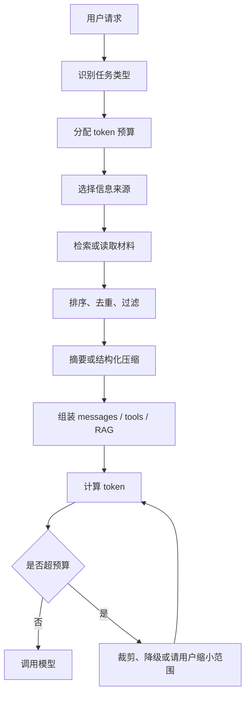

# 上下文管理

上下文管理关注的不是模型“最多能吃多少 token”，而是一次请求里应该让模型看到什么、按什么顺序看到、超过预算时删什么、压缩什么、保留什么。

一句话概括：

> 上下文管理就是把有限的 token 窗口变成可控、可解释、可降级的信息通道。

在真实系统里，模型看到的往往不是用户刚输入的那一句话，而是 system prompt、开发者指令、历史对话、工具定义、RAG 证据、工具返回结果、当前页面状态、输出格式约束和用户问题的组合。如果这些内容没有管理好，模型会变慢、变贵、变乱，甚至因为关键证据被截断而给出错误答案。

---

## 为什么需要上下文管理

上下文窗口是有限资源。即使模型支持 128K、1M 甚至更长上下文，也不代表应该把所有材料都塞进去。

上下文过长会带来几个问题：

- 成本上升：输入 token 越多，计费越高。
- 首 token 延迟上升：prefill 阶段需要先处理完整输入。
- KV Cache 压力上升：长上下文和高并发会快速消耗显存。
- 注意力干扰增加：无关材料越多，模型越容易忽略真正关键的内容。
- 截断风险增加：如果系统自动截断，可能刚好丢掉关键约束或证据。
- 调试难度增加：模型输出异常时，很难判断是 prompt、RAG、历史消息还是工具结果污染了上下文。

所以工程目标不是“填满窗口”，而是“让最相关、最可靠、最影响当前决策的信息进入窗口”。

---

## 上下文由哪些部分组成

一次模型调用中的上下文通常包括：

| 类型 | 作用 | 常见风险 |
| --- | --- | --- |
| System prompt | 定义角色、边界、安全规则和全局行为 | 过长、规则冲突、与用户任务无关 |
| Developer / instruction prompt | 应用侧任务规则、输出格式、工具使用约束 | 和 system prompt 重复或冲突 |
| 用户当前输入 | 当前问题、上传材料、指令和补充说明 | 输入过长、混入无关内容 |
| 历史对话 | 多轮任务上下文、用户偏好、已做决定 | 旧信息过期、早期约束被裁剪 |
| 工具定义 | tool name、description、parameters schema | 工具太多导致 token 膨胀 |
| 工具结果 | 搜索、数据库、命令行、浏览器、业务 API 返回 | 返回过长、噪声多、错误未标记 |
| RAG 证据 | 检索到的文档片段、标题、来源、metadata | 召回错误、重复、证据顺序不合理 |
| 输出预算 | 模型即将生成的 answer / tool call | 预留不足导致回答被截断 |

这些内容共享同一个上下文窗口。输入越长，留给输出的空间越少。

简化公式：

```text
总上下文窗口 >= 输入 token + 输出 token + 安全余量
```

安全余量很重要，因为 chat template、特殊 token、工具 schema、多模态占位符和 tokenizer 差异都会带来额外 token。

---

## 上下文装配的基本流程

一个可控的上下文构建流程通常是：



这里最关键的是两点：

1. 先按任务分配预算，再装配上下文。
2. 装配后必须实际计算 token，而不是按字符数估算。

例如，同样是 1000 个字符，中文、英文、代码、JSON、表格和日志切出来的 token 数可能差异很大。

---

## 预算怎么分配

上下文预算应该按任务类型动态分配。

以 32K 上下文窗口为例，一个知识库问答应用可以这样分配：

| 内容 | 预算示例 |
| --- | ---: |
| 系统规则和输出格式 | 1K |
| 当前用户问题 | 1K |
| 历史对话 | 3K |
| RAG 证据 | 20K |
| 工具结果 | 3K |
| 预留输出 | 4K |

如果任务变成代码修复，预算可能要调整为：

| 内容 | 预算示例 |
| --- | ---: |
| 系统规则和编辑约束 | 1K |
| 当前需求和错误信息 | 2K |
| 相关源码片段 | 14K |
| 测试、日志和命令输出 | 6K |
| 项目约定和历史决策 | 3K |
| 预留输出或补丁说明 | 6K |

没有一种固定比例适合所有业务。更实用的原则是：

- 当前任务强相关内容优先。
- 用户明确要求和硬约束优先。
- 原始证据优先于二手摘要。
- 最近消息优先，但不能无条件覆盖早期关键约束。
- 可重新检索的长材料不必常驻上下文。
- 输出预算要提前预留，不能等模型生成时再处理。

---

## 长对话如何管理

多轮对话的难点是：历史越长，过期信息、重复信息和无关闲聊越多。

常见策略如下：

| 策略 | 做法 | 适合场景 | 风险 |
| --- | --- | --- | --- |
| 保留最近 N 轮 | 只保留最近若干轮原文 | 普通客服、短任务 | 早期关键要求可能丢失 |
| 滚动摘要 | 把旧对话压缩成摘要 | 长任务、会议纪要、咨询 | 摘要可能漏掉细节 |
| 关键事实抽取 | 抽取用户偏好、任务参数、已确认决策 | Agent、项目协作 | 抽取错误会长期污染 |
| 外部记忆检索 | 把历史放到存储中，按需召回 | 跨会话、长期项目 | 检索不到就等于没有记住 |
| 状态对象 | 用 JSON / 表格维护任务状态 | 工作流、表单、代码任务 | 需要设计更新规则 |

较稳的做法是把历史拆成不同层次：

- 最近消息：原文保留，保证对话自然衔接。
- 任务状态：结构化保存，例如目标、待办、已完成、阻塞点。
- 关键决策：单独保存，避免被普通摘要稀释。
- 长材料：放在外部存储，按当前问题检索。
- 无关内容：不进入主上下文。

这样可以避免“对话越长，模型越容易被过去的噪声带偏”。

---

## 摘要压缩要注意什么

摘要可以节省 token，但它不是无损压缩。

适合摘要的内容：

- 闲聊和背景说明。
- 会议讨论过程。
- 多轮推理中的中间解释。
- 工具输出的概览。
- 长文档的章节级概括。

不适合只保留摘要的内容：

- 法律条款、合同原文。
- 代码 diff、错误栈、配置文件。
- 数字指标、时间、金额、版本号。
- 用户明确给出的硬约束。
- RAG 回答需要引用的原始证据。

一个实用规则是：如果后续回答需要精确引用、复核或执行，就保留原文或保留可回溯来源；如果只需要理解背景，可以摘要。

摘要也要有版本意识。旧摘要被新信息更新时，应明确覆盖过期事实，而不是把互相冲突的信息都堆在一起。

---

## RAG 内容怎么拼接

RAG 场景里，上下文管理的核心不是“召回越多越好”，而是“证据够用、噪声最少、来源清楚”。

推荐做法：

- 先 rerank，再拼接。
- 去掉重复片段和相似片段。
- 每个片段保留标题、来源、时间和必要 metadata。
- 把最关键证据放在靠前位置。
- 对长表格、日志、JSON 先结构化提取，再放入上下文。
- 明确告诉模型只能依据给定证据回答，证据不足时说明不足。
- 对冲突证据做标记，不要让模型自行猜哪个是真的。

一个常见拼接模板：

```text
你将基于以下证据回答用户问题。
规则：
1. 只使用证据中支持的信息。
2. 如果证据不足，直接说明无法判断。
3. 回答中标注证据编号。

[证据 1]
来源：...
时间：...
内容：...

[证据 2]
来源：...
时间：...
内容：...
```

长上下文可以让 RAG 放入更多候选材料，但不能替代检索、重排和去噪。材料越多，模型越需要清晰的证据边界。

---

## 工具定义和工具结果也要控量

Agent 应用里，工具相关内容经常是 token 消耗大户。

工具定义要控制：

- 不要给当前任务无关的工具。
- 工具描述要短而明确。
- 参数 schema 不要塞业务百科。
- 相似工具要合并或按场景路由。
- 工具调用示例只保留必要样例。

工具结果要控制：

- 命令输出优先保留错误、摘要和关键行。
- 搜索结果优先保留标题、URL、摘要和相关片段。
- 数据库查询结果优先限制行数和字段。
- 大文件读取要按需分段，不要一次性全量塞入。
- 工具失败要保留错误类型和可恢复线索。

工具结果进入上下文前最好经过一层规范化：

```text
原始工具输出 -> 过滤敏感信息 -> 提取关键字段 -> 标记来源和时间 -> 限长 -> 注入上下文
```

这能减少模型被无关日志、重复行和异常格式干扰。

---

## 超长输入如何降级

当上下文超预算时，不应该依赖模型服务自动截断。

更可控的降级顺序通常是：

1. 删除无关历史和重复材料。
2. 压缩旧对话和长工具输出。
3. 减少 RAG 片段数量，保留高相关证据。
4. 把大文件切分成分阶段任务。
5. 降低输出预算，但不能低到影响任务完成。
6. 明确告诉用户材料过长，需要缩小范围或分批处理。

不同任务的降级策略也不同：

| 任务 | 优先保留 | 可降级内容 |
| --- | --- | --- |
| 合同审查 | 原始条款、用户问题、引用来源 | 历史闲聊、低相关条款 |
| 代码修复 | 报错、相关源码、测试输出、项目约定 | 旧日志、无关文件 |
| 知识库问答 | 高相关证据、来源、问题 | 低分召回片段 |
| 数据抽取 | schema、字段定义、原文片段 | 解释性说明 |
| 创作任务 | 用户偏好、风格样例、当前要求 | 过旧版本草稿 |

最危险的做法是“从头截断”或“从尾截断”但不告诉用户。这样模型可能不知道自己没看到完整材料，还会自信回答。

---

## Agent 场景中的上下文管理

Agent 比普通问答更需要上下文管理，因为它会持续调用工具、更新计划、读取文件、处理错误并跨多轮推进任务。

一个 Agent 上下文通常需要区分：

- 目标：用户真正要完成什么。
- 当前计划：下一步做什么，哪些已完成。
- 工作状态：文件、任务、环境、权限、阻塞点。
- 证据：工具输出、搜索结果、日志、测试结果。
- 约束：不能做什么，必须遵守什么格式。
- 记忆：长期偏好、项目约定、历史决策。
- 交付物：最终要返回代码、报告、表格还是操作结果。

不建议把所有信息都常驻在主上下文里。更稳的方式是：

- 主上下文只保留目标、计划、关键状态和最近交互。
- 大文件、日志、搜索结果放在外部存储，按需读取。
- 子任务使用独立上下文，完成后只把结论和关键证据回传。
- 每次工具调用后提取摘要，不把完整噪声永久保留。
- checkpoint 保存任务状态，避免靠自然语言历史恢复进度。

这也是为什么现代 Agent 框架会强调 memory、state、checkpoint、skills、subagents 和 context builder。上下文窗口只是运行时工作区，不应该承担全部状态管理。

---

## 上下文管理如何影响质量

很多看似“模型能力不行”的问题，其实是上下文问题。

| 现象 | 可能原因 |
| --- | --- |
| 回答遗漏关键条件 | 关键约束被裁剪或位置太靠后 |
| 回答引用了旧信息 | 历史消息未清理，旧状态仍在上下文里 |
| RAG 回答胡编 | 证据不足但 prompt 没要求承认不足 |
| 格式不稳定 | 输出约束被长材料稀释 |
| 工具调用错 | 工具定义太多、描述不清或 schema 冲突 |
| 成本突然上升 | 历史、工具结果或 RAG 片段无限增长 |
| 延迟变高 | 输入 token 过多，prefill 变慢 |
| 长任务跑偏 | 计划和状态没有结构化保存 |

排查时不要只换模型。应该先查看最终发送给模型的 messages、tools、token usage、RAG 片段和工具结果。

---

## 需要记录哪些指标

上下文管理必须可观测，否则很难优化。

建议记录：

- 总输入 token。
- 总输出 token。
- system / history / RAG / tools 各自 token 占比。
- 被裁剪的内容类型和长度。
- RAG 召回数量、实际注入数量、片段来源。
- 工具定义数量和工具结果长度。
- TTFT、总延迟、重试次数。
- 因上下文超限导致的错误次数。
- 用户问题到最终回答的引用覆盖率。
- 生成失败时的上下文快照或脱敏摘要。

这些指标可以帮助判断问题到底来自模型能力、检索质量、上下文拼接、工具结果还是成本配置。

---

## 实用检查清单

上线前可以用这张清单检查：

- 是否明确区分输入预算和输出预算？
- 是否用 tokenizer 实际计算 token？
- 是否给系统规则、历史、RAG、工具结果分别设上限？
- 超预算时是否有确定的裁剪和降级策略？
- 是否保留关键约束、原始证据和可回溯来源？
- 是否避免把全部历史对话无脑塞回模型？
- RAG 片段是否经过去重、排序和来源标注？
- 工具结果是否经过限长、摘要和错误标记？
- 是否记录 token usage、裁剪记录和最终上下文结构？
- 是否测试过长输入、冲突证据、证据不足和历史污染场景？

如果这些问题没有答案，系统很容易在数据量、对话轮次或工具数量增加后变得不可控。

---

## 小结

上下文管理是 LLM 应用工程化的核心环节。它决定模型每次调用能看到什么，也直接影响成本、延迟、质量、可解释性和稳定性。

好的上下文管理不是简单扩大窗口，而是建立一套可重复的机制：

- 按任务分配预算。
- 按相关性选择材料。
- 按来源组织证据。
- 按风险保留原文。
- 按预算裁剪和降级。
- 按指标持续观察。

如果只记住一句话：上下文窗口是容量，上下文管理是调度。真正可靠的 LLM 应用，靠的是把有限窗口用在最该看的信息上。

## 相关阅读

- [上下文窗口](../llm-basics/上下文窗口.md)
- [Tokenizer](./Tokenizer.md)
- [Chat Template](./chat-template.md)
- [RAG 工程化](./RAG工程化.md)
- [工具调用](./工具调用.md)
- [KV Cache](./KV-Cache.md)
- [可观测性](./可观测性.md)
