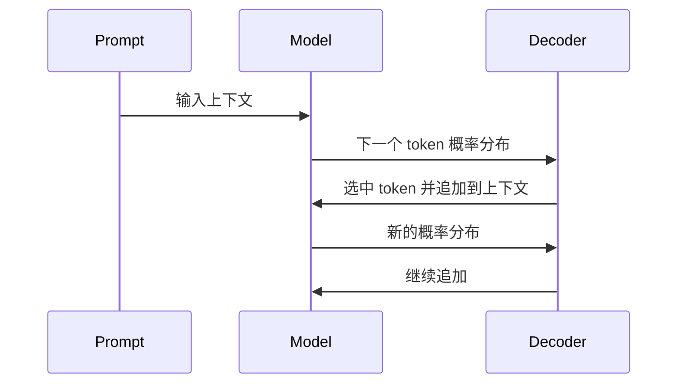

# Token 与概率

:::tip[目的]
从 token、logits、概率分布和 next token prediction 理解大语言模型的基本工作方式。
:::

简单地说，大语言模型做的是：

在每一步根据当前上下文预测下一个 token 的概率分布后，按某种解码策略选出一个 token，再把它接回上下文，继续预测下一个 token。

这个机制可以概括为：

> LLM 的生成过程，是在 token 序列上反复做 next token prediction。

理解 token、logits、softmax 和概率分布，是理解上下文长度、输出随机性、temperature、top_p、计费、推理性能和模型幻觉等的基础。

---

## 1. 什么是 Token

Token 是大语言模型处理文本的基本单位。  

它可以是一个汉字、一个英文单词、一个单词片段、一个标点、一个空格，或是某些特殊控制符。

例如一句话：

```text
AI-Basecamp 是一个知识库。
```

在不同 tokenizer 下，可能被切成类似这样的 token：

```text
["AI", "-", "Base", "camp", " 是", "一个", "知识", "库", "。"]
```

**这只是示意。真实切分取决于模型使用的 tokenizer 和词表。**

### 1.1 Token 不是“字”

中文里，一个 token 不一定等于一个汉字；英文里，一个 token 也不一定等于一个单词。

| 文本 | 可能的 token 粒度 |
| --- | --- |
| `人工智能` | 可能是一个词，也可能拆成多个字或词片段 |
| `unbelievable` | 可能拆成 `un`, `believ`, `able` |
| `API_KEY` | 可能拆成 `API`, `_`, `KEY` |
| `2026-04-18` | 可能拆成数字、横线或日期片段 |

所以估算 token 数时，不能简单按“字数”或“单词数”计算。

### 1.2 Token ID 与词表

模型并不能直接处理字符串。

在输入到模型前，Tokenizer 会把文本切成 token，并再把每个 token 映射成一个整数 ID。

```text
文本 -> 切分为 token -> 映射成 token_id 序列
```

而 token 到 token id 的映射表就是词表。

模型内部看到的是 token id 序列，而不是原始文字。

```text
文本:   AI 是工具
Tokens: ["AI", " 是", "工具"]
Token IDs:    [12345, 6789, 24680]
```

模型训练和推理时，都会围绕这些 token id 序列进行计算。

---

## 2. Embedding: 从 Token 到向量

Token id 进入模型后，会先被映射成向量，这个过程也就是 embedding。


Embedding 的作用是把离散的 token id 转成模型可以计算的连续向量。

而这个连续向量，就是一个 Token 在计算机世界中的表征。

之后，Transformer 会结合上下文中所有 token 的信息，计算每个位置的 hidden state *隐藏状态*。

对生成模型来说，最关键的是最后一个位置的隐藏状态。模型会用它预测“下一个 token 是什么”。

---

## 3. Logits

模型在预测下一个 token 时，不会直接输出概率，而是先输出一组 logits。

Logits 可以理解为模型给词表中每个 token 打的原始分数。

假设词表里只有 5 个 token，模型可能输出：

| token | logit |
| :---: | :---: |
| `猫` | 5.2 |
| `狗` | 4.7 |
| `车` | 1.1 |
| `的` | 0.8 |
| `。` | -0.5 |

logit 越高，说明模型越倾向选择这个 token。但 logit 本身不是概率，不能直接解释为 "5.2 的概率" 。

要把 logits 变成概率，需要经过 softmax。

---

## 4. Softmax 与概率分布

Softmax 会把一组 logits 转成概率分布：$ P(token_i) = \frac{e^{z_i}}{\sum_j e^{z_j}} $

转成概率后，所有 token 的概率加起来等于 1。

| token | logit | 概率示意 |
| :---: | :---: | :---: |
| `猫` | 5.2 | 0.58 |
| `狗` | 4.7 | 0.35 |
| `车` | 1.1 | 0.01 |
| `的` | 0.8 | 0.01 |
| `。` | -0.5 | 0.00 |

这就是“下一个 token 概率分布”。

模型不是给出一个确定答案，而是在每一步给出一个概率分布。解码器再根据这个概率分布选择下一个 token。

---

## 5. Next Token Prediction

语言模型训练的核心任务通常是 next token prediction。

给定一段 token 序列：

```text
["北京", "是", "中国", "的"]
```

模型要预测下一个 token：

```text
["首都"]
```

训练数据可以被拆成大量这样的预测任务：

| 输入上下文 | 目标 token |
| --- | --- |
| `北京` | `是` |
| `北京 是` | `中国` |
| `北京 是 中国` | `的` |
| `北京 是 中国 的` | `首都` |

模型训练的目标，是让真实的 next token 的概率尽可能高。

这就是为什么语言模型可以学到语法、事实、推理模式、代码结构和对话风格：它在海量文本中反复学习“在这个上下文后面，什么 token 更可能出现”。

---

## 6. 重复生成

模型一次计算通常只预测下一个 token。生成一段回答时，它会不断重复这个过程。

```text
输入: 解释什么是 KV Cache
第 1 步: 输出 "KV"
第 2 步: 输出 " Cache"
第 3 步: 输出 " 是"
第 4 步: 输出 " 大"
第 5 步: 输出 "语言"
...
```

每输出一个 token，这个 token 就会被追加到上下文中，影响下一步预测。



这也解释了两个现象：

- 输出越长，推理时间越长。
- 前面生成的错误 token 会影响后面内容。

---

## 7. 解码

有了概率分布后，系统要决定选哪个 token。

### 7.1 Greedy 与 Sampling策略

#### Greedy Decoding 策略

Greedy 策略就是每一步都选概率最高的 token。

| token | 概率 |
| :---: | :---: |
| `猫` | 0.58 |
| `狗` | 0.35 |
| `车` | 0.01 |

按 Greedy 策略会选择 `猫`。

这个策略的优点是稳定、可复现、适合确定性任务。缺点是容易死板，可能陷入重复，也可能错过更自然的表达。

#### Sampling 策略

Sampling 策略则会按概率随机抽样。

如果 `猫` 概率 0.58，`狗` 概率 0.35，那么多数时候会选 `猫`，但也可能选 `狗`。

这就是同一个问题多次回答可能不同的原因。

Sampling 策略更适合创作、头脑风暴、开放式问答；但对代码生成、数据抽取、结构化输出等任务，随机性过强会降低稳定性。

一般来说，现在的 LLM 普遍采用概率抽样。

---

### 7.2 Temperature：概率分布调整

前面说 Sampling 会“按概率随机抽样”，但真实推理时通常不会直接使用原始概率分布，而是会先用一些参数调整这个分布，再从调整后的分布中采样。

Temperature 就是最常见的调整参数：它不改变模型已经学到的知识，也不重新训练模型，只是在解码阶段改变不同 token 被抽中的相对机会。

在采样前，系统通常会先用 temperature $T$ 调整 logits，再做 softmax：

$$
P(token_i) = \frac{e^{z_i / T}}{\sum_j e^{z_j / T}}
$$
( $z_i$ 是第 $i$ 个 token 的 logit，$T$ 是 temperature。$T$ 越小，高 logit token 的优势越明显；$T$ 越大，不同 token 之间的概率差距越小。)

即 Temperature 会改变概率分布的“尖锐程度”。

低 temperature 会让高概率 token 更突出，输出更稳定。

高 temperature 会让低概率 token 更有机会被选中，输出更发散。

| Temperature | 效果 | 适合场景 |
| :---: | :---: | :---: |
| 0 或接近 0 | 接近 greedy，稳定、保守 | 代码、抽取、分类、格式化 |
| 0.2 - 0.7 | 有一定变化但不太发散 | 问答、解释、总结 |
| 0.8 以上 | 更随机、更有创意 | 创作、 brainstorming |

Temperature 不是“智商旋钮”。它控制的是采样分布，不会让模型学到新知识。

---

### 7.3 Top-k 与 Top-p

Top-k 和 Top-p 都是限制采样候选范围的方法。

#### Top-k

Top-k 只保留概率最高的 k 个 token，然后在这些 token 中采样。

例如 `top_k = 3`，模型只会在概率前三的 token 里选。

#### Top-p

Top-p 又叫 nucleus sampling。它会保留累计概率达到 p 的最小 token 集合。

例如 `top_p = 0.9`，系统会从高到低累加 token 概率，直到总概率达到 0.9，然后只在这个集合里采样。

Top-p 比 Top-k 更动态：当模型很确定时，候选集合会小；当模型不确定时，候选集合会大。

---

### 7.4 概率分布与不确定性

概率分布可以反映模型的局部不确定性。

如果最高概率 token 明显高于其他 token，说明模型在当前一步比较确定：

| token | 概率 |
| :---: | :---: |
| `巴黎` | 0.92 |
| `伦敦` | 0.03 |
| `柏林` | 0.02 |

如果多个 token 概率接近，说明模型更不确定：

| token | 概率 |
| :---: | :---: |
| `可能` | 0.21 |
| `通常` | 0.19 |
| `一般` | 0.18 |
| `也许` | 0.12 |

但要注意：token-level 概率不等于“事实置信度”:  
模型可能对一个错误事实给出很流畅、很高概率的表达；也可能在多个正确表达之间概率分散。因此，不能简单把生成概率当成事实可靠性的直接度量。

---

### 7.5 概率和幻觉的关系

幻觉不是因为模型“没有概率”，而是因为 next token prediction 的目标和事实校验不是一回事。

模型会生成在当前上下文中“看起来最可能”的 token 序列，但这个序列未必和外部世界一致。

例如：

- 训练数据中过时，模型仍按旧信息生成。
- prompt 暗示了错误前提，模型顺着前提补全。
- 缺少检索或工具校验，模型用语言模式填空。
- 多个相似实体混淆，模型生成了合理但错误的细节。

降低幻觉通常不能只靠调 temperature。更有效的办法是：

- 引入检索或工具校验。
- 要求引用来源。
- 限制回答范围。
- 对关键事实做二次验证。
- 在系统设计中允许模型说“不知道”。

---

## 8. **处理 token的完整流程**

用户看到的是文字，但模型内部一直在处理 token。

完整流程是：

1. 用户输入文本。
2. Tokenizer 把文本切成 token 并对应 token ids。
3. 模型根据 token ids 计算下一个 token 的 logits。（这里会涉及 **Embedding** 与 **Transformer** 等内容）
4. Softmax 把 logits 转成概率分布。
5. 解码策略选出一个 token id。
6. Tokenizer 把 token id 解码回文本片段。
7. 重复直到遇到停止条件。

停止条件可能包括：

- 生成了结束 token。
- 达到最大输出 token 数。
- 命中 stop sequence。
- 用户中断。
- 服务端超时或策略拦截。

---

## 9. Token 数为什么重要

Token 数影响三个工程问题：上下文长度、成本和速度。

### 上下文长度

模型有最大上下文窗口，例如 32K、128K、1M tokens。

输入、历史对话、工具结果、系统提示词和输出都要占用 token 预算。

如果上下文超限，系统必须做截断、摘要、检索或压缩。

### 计费

许多模型按 token 计费，通常区分输入 token 和输出 token。

```text
总成本 = 输入 token 成本 + 输出 token 成本
```

Agent 场景尤其容易消耗 token，因为它会包含：

- 系统提示词。
- 工具说明。
- 历史对话。
- 检索结果。
- 工具返回内容。
- 多轮中间推理和最终回答。

### 推理性能

在研究模型的性能特别是推理速度时，有些常见指标与 Token 或者 Token 数量高度相关：

| 指标 | 含义 |
| :---: | :---: |
| TTFT | Time To First Token，首 token 延迟 |
| TPS | Tokens Per Second，每秒输出 token 数 |
| 输入长度 | 影响 prefill 阶段耗时 |
| 输出长度 | 影响 decode 阶段耗时 |

输入越长，模型 prefill 越重；输出越长，模型 decode 轮数越多。

---

## 10. Prompt 设计中的 Token 视角

从 token 和概率角度看，prompt 的作用是改变下一个 token 的概率分布。

好的 prompt 不是“命令模型必须怎样”，而是通过上下文、示例、约束和格式，让正确输出的 token 序列概率更高。

常见技巧：

- 给出明确任务，减少模型猜测空间。
- 提供输出格式，让结构化 token 更容易出现。
- 给少量示例，引导模型学习模式。
- 把无关上下文拿掉，避免概率分布被干扰。
- 对事实问题提供来源材料，不让模型凭语言模式补全。

对于结构化输出，最好配合 schema、parser、工具调用或 JSON mode 等，而不是只靠自然语言要求“请严格输出 JSON”。

---

### 一个小例子

假设 prompt 是：

```text
中国的首都是
```

模型可能给出这样的下一个 token 分布：

| token | 概率 |
| :---: | :---: |
| `北京` | 0.96 |
| `上海` | 0.01 |
| `中国` | 0.01 |
| `首都` | 0.00 |

这一步大概率会输出 `北京`。

如果 prompt 换成：

```text
中国最适合国际金融业务的城市是
```

概率分布可能变得更分散：

| token | 概率 |
| :---: | :---: |
| `上海` | 0.48 |
| `香港` | 0.31 |
| `北京` | 0.08 |
| `深圳` | 0.05 |

这说明模型并不是先想出一个固定答案再打字，而是在不同上下文下重新计算概率分布。

---

## 11. 常见误区

### Token 越少越好

不是。Token 少可以省成本，但上下文不足会降低质量。关键是保留有效信息，删除噪音。

### 概率最高的一定最正确

不是。概率最高表示在模型学到的分布中最可能，不等于真实世界中最正确。

### Temperature 越低越专业

不一定。低 temperature 更稳定，但也可能让模型在错误路径上稳定输出。专业性更多依赖模型能力、上下文质量和验证机制。

### 长上下文可以替代检索和记忆管理

不能完全替代。长上下文提高容量，但不保证模型能正确关注所有内容。工程上仍需要摘要、检索、排序、引用和状态管理。

---

## 小结

- Token 是模型处理文本的基本单位。
- 模型通过 词表 、Tokenizer、和 Embedding 过程把 Token 变成向量，进而对向量进行计算。
- logits 是模型对下一个 token 的原始打分。
- softmax 把 logits 转成概率分布。
- 解码策略再从概率分布中选择 token。

理解这套机制后，很多 LLM 现象都会更容易解释：

- 为什么同一个问题可能多次回答不同。
- 为什么 temperature、 top_p、top_k 等会影响输出风格。
- 为什么长输出更慢、更贵。
- 为什么 prompt 会改变模型行为。
- 为什么概率高不等于事实正确。
- 为什么 Agent 场景特别需要上下文管理和工具校验。

大语言模型表面上是在“写文字”，底层其实是在 token 空间中不断预测、选择和追加。
