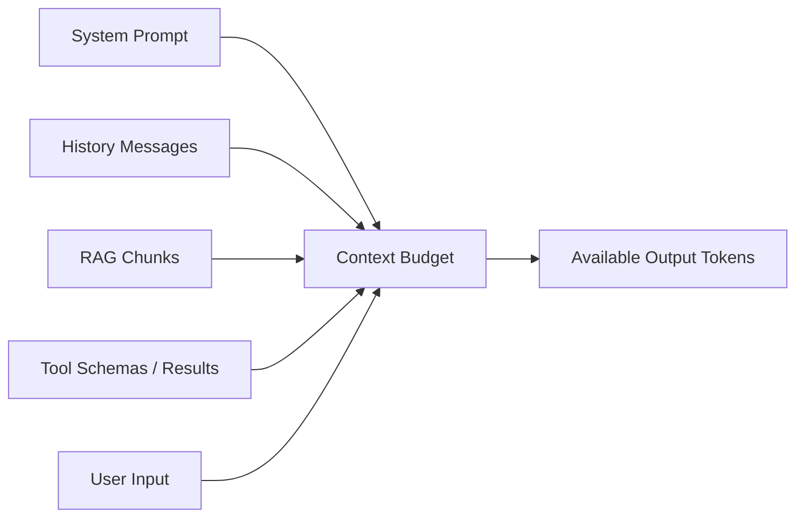

# 上下文窗口

本文用于解释模型最大上下文长度是什么，以及输入、输出、历史对话和检索内容如何共享上下文预算。

一句话概括：

> 上下文窗口决定模型在一次请求中最多能看到多少 token。

上下文窗口不是“模型记忆力”的全部，也不是越大越好。它更像一次推理调用的工作台：system prompt、用户输入、历史消息、工具说明、检索结果、图片文本化内容和模型即将生成的回答，都要放在这张工作台上。

---

## 什么是上下文窗口

上下文窗口通常用 token 数表示，例如 8K、32K、128K、1M tokens。

这里的 token 不是字符，也不一定是单词。不同模型的 tokenizer 不同，同一段文本切出来的 token 数也可能不同。详细概念可以先看 [Token 与概率](./Token与概率.md)。

如果一个模型标称支持 128K context length，意思通常是：

```text
输入 token + 输出 token <= 128K
```

也就是说，上下文窗口不是只给输入使用，输出也要占用预算。

例如：

| 最大上下文 | 输入 token | 最多还能输出 |
| --- | ---: | ---: |
| 32K | 4K | 约 28K |
| 32K | 24K | 约 8K |
| 128K | 100K | 约 28K |

真实服务中还会有额外限制，例如单次最大输出 token、服务端网关限制、模型部署参数、费用限制和超时限制。因此“模型支持 128K”不等于“业务请求一定能稳定塞满 128K 并生成很长回答”。

---

## 上下文里包含什么

一次模型调用中，进入上下文的内容可能包括：

| 内容 | 说明 |
| --- | --- |
| System prompt | 系统角色、行为边界、安全规则、输出要求 |
| Developer / instruction prompt | 应用侧注入的任务规则、格式要求、工具使用约束 |
| 用户输入 | 当前问题、上传文本、复制的代码或文档 |
| 历史消息 | 多轮对话中的前文 |
| 工具定义 | function calling / tool calling 的名称、参数 schema 和描述 |
| 工具结果 | 搜索结果、数据库查询结果、命令输出、网页内容 |
| RAG 内容 | 检索召回的文档片段、引用和 metadata |
| 模型已生成内容 | 自回归生成时，前面生成的 token 会继续作为后续上下文 |

这也是 Agent 场景 token 消耗很快的原因。一个看似简单的问题，实际传给模型的可能是：

```text
系统规则 + 工具列表 + 项目说明 + 历史对话 + 检索片段 + 工具返回 + 用户问题
```

如果这些内容没有管理好，模型不仅会变慢变贵，还可能被无关信息干扰。

---

## 输入和输出共享预算

很多人会把“最大上下文长度”和“最大输入长度”混在一起。更准确的理解是：输入和输出共享同一个序列长度上限。

假设模型最大上下文是 16K，服务端允许最大输出 4K。

如果输入已经有 15K token，那么理论上只剩约 1K token 给输出。即使 API 参数里设置 `max_tokens = 4096`，系统也可能报错、自动压缩、截断，或只生成很短的回答。

简化流程如下：



工程上通常要提前计算：

```text
可用输出预算 = 最大上下文长度 - 已占用输入 token - 安全余量
```

安全余量很重要。因为 tokenizer 差异、模板包装、工具 schema、特殊 token 和多模态内容都可能带来额外 token。

---

## 超过上下文窗口会怎样

当输入超过模型或服务允许的最大上下文长度时，常见结果有几种：

| 处理方式 | 说明 | 风险 |
| --- | --- | --- |
| 直接报错 | API 或推理框架拒绝请求 | 用户体验差，但最可控 |
| 自动截断 | 丢掉开头、结尾或部分历史 | 可能丢关键事实 |
| 自动摘要 | 把旧内容压缩成短摘要 | 摘要可能遗漏细节 |
| 滑动窗口 | 只保留最近一段上下文 | 适合连续生成，不适合全局问答 |
| 检索重组 | 只选择相关片段进入窗口 | 依赖检索质量 |

自动截断最危险，因为模型可能不知道自己没看到完整材料。

例如用户上传一份合同，关键限制条款在第 2 页，但系统截断时只保留了最后几页。模型仍然可能自信回答，却没有看到真正相关的内容。

更稳妥的方式是：在应用层显式管理上下文，超过预算时明确选择保留什么、压缩什么、丢弃什么，并在必要时告诉用户材料过长。

---

## 长上下文解决了什么

长上下文模型可以把更多材料放进一次请求里。

它适合：

- 长文档问答。
- 多文件代码理解。
- 长会议纪要总结。
- 法律、投研、科研等长材料分析。
- Agent 执行长任务时保留更多过程信息。
- RAG 中放入更多候选证据。

和短上下文相比，长上下文的主要价值是减少“必须提前切得很碎”的压力，让模型可以在更大范围内做综合判断。

例如分析一个代码仓库时，短上下文只能看单个函数或单个文件；长上下文可以同时放入调用链、测试、配置和错误日志。

但长上下文只是容量变大，不代表模型一定会正确使用所有内容。

---

## 长上下文不等于长期记忆

上下文窗口是一次请求内的可见范围。长期记忆是跨请求、跨会话保留信息的能力。

两者不同：

| 概念 | 生命周期 | 例子 |
| --- | --- | --- |
| 上下文窗口 | 单次请求或当前会话片段 | 当前 prompt、历史消息、检索结果 |
| 长期记忆 | 跨会话持久保存 | 用户偏好、项目背景、历史决策 |

即使模型有 1M token 上下文，如果下一次请求没有把这些内容重新放进去，模型也看不到。

Agent 系统通常会把两者结合起来：

- 把当前任务最相关的内容放入上下文窗口。
- 把长期偏好、项目事实、任务状态存到外部记忆或数据库。
- 每次调用前检索相关记忆，再按预算注入上下文。

所以长上下文不能替代记忆系统。它只是让每次调用能带入更多工作材料。

---

## 长上下文不等于有效理解长上下文

模型“能接收”很长输入，不等于“能稳定利用”很长输入。

长上下文评估常见一个测试叫 Needle in a Haystack：把一条关键事实藏在很长文本中，让模型回答这条事实是什么。

这个测试关注的是：

- 模型能否从长文本中找到关键片段。
- 关键片段放在开头、中间、结尾时表现是否稳定。
- 输入变长后，召回是否下降。
- 无关内容增加后，模型是否被干扰。

实际应用里也有类似问题：

- 合同里某个例外条款被淹没在大量模板文本中。
- 代码仓库里真正的 bug 在一个不显眼的 helper 函数里。
- RAG 召回了 20 段内容，但关键证据在第 17 段。
- 多轮对话很长，用户早期给过的重要约束被模型忽略。

因此，长上下文仍然需要排序、摘要、结构化和引用机制。

---

## 为什么长上下文更贵

长上下文带来的成本主要来自三方面：prefill、KV Cache 和注意力计算。

### Prefill 延迟

模型生成第一个 token 前，需要先处理输入上下文，这个阶段通常叫 prefill。

输入越长，prefill 越慢。用户感受到的就是首 token 延迟变高。

### KV Cache 显存

自回归生成时，模型会把历史 token 的 Key 和 Value 保存下来，避免每生成一个 token 都重新计算全部历史。这部分缓存叫 KV Cache。

上下文越长、并发越高，KV Cache 占用越大。

简化理解：

```text
KV Cache 显存 ≈ 层数 × KV heads × head dim × token 数 × 精度 × 并发
```

实际公式还取决于模型结构、GQA/MQA、推理框架和分页策略。更详细的工程解释见 [KV Cache](../engineering/KV-Cache.md)。

### 注意力成本

标准 Attention 会让 token 之间计算关联。现代推理框架有 FlashAttention、PagedAttention、滑动窗口、稀疏注意力等优化，但长输入仍然会增加计算和显存压力。

所以长上下文能力通常伴随这些取舍：

| 维度 | 影响 |
| --- | --- |
| 成本 | 输入 token 更多，计费更高 |
| 延迟 | prefill 更慢，首 token 更晚 |
| 显存 | KV Cache 更大，并发更难做高 |
| 质量 | 无关信息更多，注意力干扰更强 |

---

## 长上下文和位置编码

上下文长度还和位置编码有关。

Transformer 需要知道 token 的顺序和相对距离。现代 LLM 常用 RoPE 等位置编码方法。模型是否能稳定扩展到更长上下文，取决于训练长度、位置编码设计、RoPE scaling、长上下文数据和推理实现。

常见误区是：把配置里的 `max_position_embeddings` 改大，就以为模型获得了长上下文能力。

这通常不可靠。配置允许更长输入，只代表框架尝试接收更多 token，不代表模型训练过这些位置，也不代表模型能有效利用远距离信息。

相关细节可以看 [位置编码](./位置编码.md)。

---

## RAG 中怎么使用上下文窗口

RAG 的核心不是“把所有召回内容塞进去”，而是把最可能有用的证据放进有限上下文。

一个常见流程是：


上下文组装时需要考虑：

- 相关性高的片段优先。
- 关键证据尽量靠前。
- 重复片段要去掉。
- 每个片段保留来源和标题。
- 长表格、日志、JSON 先做结构化摘要。
- 如果证据不足，允许模型回答无法判断。

长上下文可以让 RAG 放入更多候选材料，但不能替代检索排序。材料越多，噪音也越多。

---

## 多轮对话中的上下文策略

多轮对话不能无限保留所有历史。常见策略包括：

| 策略 | 适合场景 | 风险 |
| --- | --- | --- |
| 保留最近 N 轮 | 普通聊天、客服 | 早期约束可能丢失 |
| 重要信息抽取 | 用户偏好、任务参数 | 抽取错误会污染后续 |
| 滚动摘要 | 长任务、会议记录 | 摘要会压缩细节 |
| 外部记忆检索 | 长期项目、Agent | 检索不到就等于没记住 |
| 分阶段上下文 | 工作流、代码任务 | 需要设计状态机 |

比较稳的做法是把历史分成几类：

- 最近消息：原文保留。
- 任务状态：结构化保存。
- 关键决策：单独记录。
- 长材料：外部存储，按需检索。
- 无关闲聊：不进入主上下文。

这样可以避免对话越长越慢，也减少模型被旧信息误导。

---

## Agent 中的上下文窗口

Agent 比普通问答更依赖上下文管理。

一个 Agent 可能需要同时处理：

- 用户目标。
- 当前计划。
- 工具权限。
- 文件内容。
- 命令输出。
- 浏览器页面。
- 子任务状态。
- 历史失败原因。
- 最终交付格式。

如果所有信息都堆进一个窗口，模型很快会遇到上下文膨胀。

常见工程做法包括：

- 主 Agent 只保留目标、计划和关键状态。
- 子 Agent 使用独立上下文处理局部任务。
- 工具输出先摘要，再进入主上下文。
- 大文件按需读取，不一次性全塞。
- 失败日志分类保存，只注入当前相关部分。
- 把 checklist、trace、checkpoint 存在外部状态中。

这也是为什么现代 Agent 框架会强调 memory、state、checkpoint、skills、subagents 和 context builder。上下文窗口只是 Agent 运行时的一部分，不应该承担全部状态管理。

---

## 上下文预算怎么分配

实际应用中，可以先给不同内容分配预算。

例如一个 32K 上下文的知识库问答应用：

| 内容 | 预算示例 |
| --- | ---: |
| System prompt 和输出规则 | 1K |
| 用户问题和当前页面信息 | 2K |
| 历史对话 | 4K |
| RAG 证据片段 | 18K |
| 工具结果 | 3K |
| 预留输出 | 4K |

这不是固定答案。不同业务应该按任务调整：

- 摘要任务：输入材料预算更大，输出预算中等。
- 代码生成：相关文件和错误日志预算更大。
- 数据抽取：schema 和示例要保留，输出预算可控。
- 创作任务：用户偏好和示例重要，RAG 可能较少。
- Agent 任务：计划、状态和工具结果需要动态滚动。

关键原则是：先保留影响当前决策的信息，再保留背景材料。

---

## 常见优化方法

### 裁剪

删除无关内容，例如过旧的闲聊、重复日志、无关文档片段。

裁剪应该基于任务相关性，而不是简单按时间或长度。

### 摘要

把长历史压缩成短摘要。

摘要适合保留大意，但不适合替代关键原文。法律条款、代码 diff、数字指标、错误栈等内容，最好保留原始片段或可回溯引用。

### 检索

把大量文档放在外部存储中，每次只召回相关片段。

检索适合知识库、项目文档、历史记录和长期记忆。

### 结构化

把松散文本整理成表格、JSON、任务状态或事实列表。

结构化信息更容易控制长度，也更便于后续更新。

### 分阶段处理

把一个大任务拆成多个模型调用：

1. 先提取事实。
2. 再聚合证据。
3. 再生成结论。
4. 最后做校验。

这种方式比一次性把全部内容塞进模型更可控。

---

## 什么时候应该用长上下文模型

适合用长上下文模型的情况：

- 输入材料确实很长，且跨段落关系重要。
- 需要同时比较多个文件、多个版本或多个证据。
- 检索切块会破坏上下文连续性。
- 用户希望模型先整体阅读，再综合判断。
- 任务对遗漏信息很敏感。

不一定需要长上下文的情况：

- 问题只依赖少量事实。
- 可以用检索精确召回相关片段。
- 输出格式固定，输入结构清晰。
- 成本和延迟比覆盖更多材料更重要。
- 业务可以接受多阶段处理。

长上下文模型是工具，不是默认最优解。很多生产系统会组合使用短上下文模型、长上下文模型、Embedding、rerank、摘要和规则校验。

---

## 常见误区

### 上下文窗口越大，回答一定越好

不是。更大的窗口提供更多容量，但也可能带来更多噪音、成本和延迟。关键是放入正确内容。

### 模型支持 128K，就可以输入 128K 再输出很多

不一定。输入和输出共享上下文预算，服务端还可能限制最大输出、请求大小和超时时间。

### 长上下文可以替代 RAG

不能完全替代。长上下文让你能放更多材料，但 RAG 负责找到、排序和引用相关材料。两者解决的问题不同。

### 长上下文可以替代长期记忆

不能。上下文窗口是一次请求内可见内容，长期记忆需要外部存储和检索机制。

### 截断一点历史没关系

不一定。被截断的可能正是关键约束、用户偏好或事实来源。生产系统应该显式管理截断策略。

---

## 小结

上下文窗口决定模型一次推理最多能看到多少 token。它包括输入、历史消息、工具定义、工具结果、RAG 内容和即将生成的输出。

理解上下文窗口时，要抓住几个关键点：

- 输入和输出共享同一个 token 预算。
- token 数不等于字符数或字数。
- 超长输入需要显式裁剪、摘要、检索或分阶段处理。
- 长上下文可以放入更多材料，但不保证模型稳定利用所有材料。
- 长上下文会增加 prefill 延迟、KV Cache 显存和推理成本。
- 上下文窗口不是长期记忆，Agent 和 RAG 仍需要外部状态管理。

对工程实践来说，真正重要的不是“最多能塞多少 token”，而是“当前任务最需要哪些信息，以及如何用可控成本把它们放到模型面前”。
