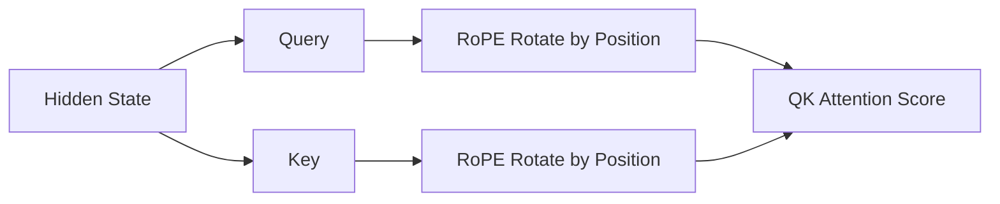

# 位置编码

Transformer 的 Self-Attention 可以让每个 token 关注上下文中的其他 token，但它本身并不天然知道 token 的顺序。对 Attention 来说，如果没有额外位置信息，一组 token 更像是一个集合，而不是一个有先后顺序的句子。

位置编码的作用，就是把“第几个 token”“两个 token 相隔多远”这类顺序信息注入模型。

一句话概括：

> 位置编码让 Transformer 知道 token 在序列中的位置。

现代 LLM 中，位置编码不仅影响模型是否能理解语序，还会影响上下文长度、长文本外推、KV Cache、微调兼容性和推理部署。

---

## 为什么 Self-Attention 不天然知道顺序

Self-Attention 的核心是让每个 token 的 Query 和其他 token 的 Key 做相似度计算，再根据权重聚合 Value。

简化公式：

```text
Attention(Q, K, V) = softmax(QK^T / sqrt(d)) V
```

如果输入 token 向量本身不包含位置信息，那么 Attention 只知道“有哪些 token”，不知道“这些 token 的顺序是什么”。

例如：

```text
狗 咬 人
人 咬 狗
```

这两句话包含相同 token，但含义不同。如果模型不知道顺序，就很难区分谁是动作发起者，谁是动作承受者。

因此，Transformer 需要额外机制表达位置。

---

## 位置编码解决什么问题

位置编码主要解决三类问题：

| 问题 | 说明 |
| --- | --- |
| 绝对位置 | 当前 token 是第 1 个、第 20 个，还是第 1000 个 |
| 相对位置 | 两个 token 相隔多远，谁在谁前面 |
| 长度泛化 | 训练时见过 4K 长度，推理时能否处理 32K 或更长 |

不同位置编码方法，对这三类问题的侧重点不同。

---

## 绝对位置编码

最直观的方法是给每个位置一个向量。

```text
input_vector = token_embedding + position_embedding
```

例如：

| 位置 | position embedding |
| --- | --- |
| 0 | `p0` |
| 1 | `p1` |
| 2 | `p2` |
| ... | ... |

模型输入时，把 token embedding 和位置 embedding 相加：

```text
第 0 个 token: token_embedding("我") + p0
第 1 个 token: token_embedding("喜欢") + p1
第 2 个 token: token_embedding("猫") + p2
```

这样模型就能区分同一个 token 出现在不同位置时的表示。

### 可学习绝对位置编码

可学习绝对位置编码把每个位置的向量当作模型参数训练。

优点：

- 简单直接。
- 对训练长度内的位置表达能力强。

缺点：

- 最大位置通常固定。
- 超出训练位置后不好外推。
- 长上下文扩展时需要额外处理。

早期 BERT、GPT 类模型常使用可学习绝对位置 embedding。

---

## 正弦余弦位置编码

原始 Transformer 使用固定的正弦余弦函数表示位置。

直觉上，它用不同频率的 sin / cos 波形为每个位置生成一个向量。

这种方式的特点：

- 不需要学习位置参数。
- 每个位置有确定编码。
- 理论上可以外推到更长位置。
- 不同维度对应不同频率，既能表达局部变化，也能表达长距离模式。

简化理解：

```text
position 0 -> [sin/cos pattern]
position 1 -> [slightly shifted pattern]
position 2 -> [another shifted pattern]
```

正弦余弦位置编码在原始 Transformer 中很重要，但现代 Decoder-only LLM 更常见的是 RoPE。

---

## 绝对位置与相对位置

绝对位置回答的是：

```text
这个 token 在第几个位置？
```

相对位置回答的是：

```text
这两个 token 相隔多远？
```

语言理解里，相对位置通常更重要。

例如：

```text
小明把书给了小红，因为她要复习。
```

模型需要理解“她”和“小红”的关系，关键不是它们分别在第几个 token，而是它们之间的距离、语法关系和上下文结构。

这也是为什么很多现代位置机制更强调相对位置信息。

---

## RoPE 的直觉

RoPE 是 Rotary Position Embedding，中文常叫旋转位置编码。

它不是简单地把位置向量加到 token embedding 上，而是在 Attention 中对 Query 和 Key 做旋转变换。

简化理解：

```text
Q_positioned = rotate(Q, position)
K_positioned = rotate(K, position)
```

不同位置对应不同旋转角度。两个 token 做 attention 时，Query 和 Key 的相似度会自然包含相对位置信息。



RoPE 的关键直觉是：

- token 的内容通过 Q/K 表达。
- token 的位置通过旋转角度注入。
- 两个位置的旋转差影响注意力分数。
- 因此 Attention 可以感知相对距离。

很多现代 LLM 使用 RoPE，例如 LLaMA、Qwen、Mistral、DeepSeek 等模型家族中的大量版本。

---

## RoPE 为什么适合 Decoder-only LLM

RoPE 在现代 LLM 中常见，主要有几个原因：

- 不需要为每个绝对位置学习独立向量。
- 能在 Attention 中自然表达相对位置信息。
- 对自回归生成和 KV Cache 友好。
- 实现上可以集成到 Q/K 计算流程中。
- 长上下文扩展时有相对成熟的 scaling 方法。

在 Decoder-only 模型中，每次生成新 token 时，只需要为新位置的 Q/K 应用对应的 RoPE 变换，并复用历史 KV Cache。

---

## ALiBi 的直觉

ALiBi 是 Attention with Linear Biases。

它不显式给 token 加位置向量，而是在 attention score 中加入一个和距离相关的 bias。

直觉上：

```text
距离越远，attention score 被扣得越多。
```

示意：

| 距离 | bias |
| --- | ---: |
| 1 | -0.1 |
| 10 | -1.0 |
| 100 | -10.0 |

这样模型会天然更偏向近处 token，同时仍然可以关注远处 token。

ALiBi 的特点：

- 机制简单。
- 对长上下文外推友好。
- 不需要学习位置 embedding。
- 通过 attention bias 表达距离惩罚。

它的风格和 RoPE 不同：RoPE 通过旋转 Q/K 注入相对位置，ALiBi 通过 attention 分数偏置表达距离。

---

## 位置编码与 KV Cache

推理时，模型通常会使用 KV Cache 保存历史 token 的 Key 和 Value，避免每生成一个 token 都重新计算完整上下文。

位置编码会影响 KV Cache 的正确性。

以 RoPE 为例，Key 在写入 KV Cache 前已经包含对应位置的旋转信息。生成后续 token 时，新 token 的 Query 使用新位置的旋转，再和历史 Key 做 attention。

如果位置编号错了，模型就会把历史 token 当成错误位置上的内容，导致输出异常。

常见问题包括：

- 继续生成时 position id 没接上。
- 多轮对话拼接后位置偏移错误。
- 左 padding / 右 padding 与 position id 不匹配。
- 滑动窗口或截断后没有正确重算位置。
- speculative decoding 或并行解码中位置处理不一致。

因此，推理框架里 position ids、attention mask 和 KV Cache 必须严格对齐。

---

## 长上下文与位置外推

长上下文能力不只是“显存够不够”，还和位置编码有关。

如果模型训练时最大上下文是 4K，推理时直接喂 32K，模型可能遇到没见过的位置范围。不同位置编码方法的外推能力不同。

可能出现的问题：

- 模型无法稳定利用远距离信息。
- 注意力分布异常。
- 远处内容被忽略。
- 输出格式混乱。
- Needle in a Haystack 测试下降。
- 长文本中间内容召回变差。

这也是为什么长上下文模型通常需要在训练、位置编码、数据配比和推理实现上一起调整。

---

## RoPE Scaling

RoPE scaling 是扩展 RoPE 上下文长度的一类方法。

直觉上，RoPE 用位置决定旋转角度。如果推理长度远超训练长度，旋转角度分布会进入模型不熟悉的范围。RoPE scaling 会调整位置到旋转角度的映射，让更长序列落在模型更可处理的频率范围内。

常见思路包括：

- 线性缩放位置。
- 调整 RoPE base / theta。
- 对不同频率维度使用不同缩放策略。
- 结合长上下文继续训练。

工程上需要注意：RoPE scaling 不是随便改配置就一定有效。

如果只改 `rope_scaling`、`max_position_embeddings` 或 `rope_theta`，但模型没有经过相应长上下文训练或校准，可能只是“能跑更长输入”，不代表“能有效理解更长上下文”。

---

## 位置编码配置常见字段

在模型配置中，经常会看到这些字段：

| 字段 | 含义 |
| --- | --- |
| `max_position_embeddings` | 模型配置的最大位置数量 |
| `rope_theta` | RoPE 频率基数，影响旋转频率 |
| `rope_scaling` | RoPE 缩放配置 |
| `sliding_window` | 滑动窗口 attention 的窗口大小 |
| `max_sequence_length` | 推理服务或框架允许的最大序列长度 |
| `original_max_position_embeddings` | 某些扩展模型记录的原始训练长度 |

不同模型和框架字段名可能不同。部署时不要只看一个字段，要同时确认 tokenizer、模型 config、推理引擎参数和服务端限制。

---

## 配置错误会出现什么现象

位置编码或 position id 配错时，模型不一定直接报错，更常见的是输出质量异常。

可能表现：

- 短输入正常，长输入明显变差。
- 长文档问答经常漏掉后半段或中间信息。
- 输出重复、断裂、格式混乱。
- 多轮对话突然忘记前文。
- batch 推理时不同样本互相影响。
- 继续生成接不上已有文本。
- 同一模型在不同推理框架中效果差异很大。

排查时可以检查：

- 模型配置中的 RoPE 参数是否与权重匹配。
- 推理服务的最大上下文是否超过模型实际能力。
- tokenizer 的 padding side 是否和框架处理一致。
- attention mask 和 position ids 是否正确。
- KV Cache 在截断、复用、分页时是否保持位置一致。

---

## 位置编码与检索/RAG

长上下文模型让我们可以放入更多材料，但位置编码和注意力机制并不保证模型会平等利用所有位置。

RAG 中常见问题包括：

- 相关片段放得太靠后，模型关注不足。
- 多个片段顺序不合理，造成推理干扰。
- 中间位置内容容易被忽略。
- 输入太长导致关键证据被噪音稀释。

因此，即使模型支持长上下文，RAG 仍需要：

- 召回排序。
- rerank。
- 上下文压缩。
- 引用标注。
- 关键信息前置。
- 分段回答或多轮检索。

长上下文不是 RAG 的替代品。它只是提供更大的上下文预算。

---

## 常见误区

### Transformer 天然懂顺序

不是。Self-Attention 本身不包含顺序信息，需要位置编码或类似机制注入顺序。

### `max_position_embeddings` 改大就等于长上下文

不是。配置改大只能让框架尝试接受更长输入，不代表模型训练过这些位置，也不代表能可靠利用长上下文。

### RoPE scaling 一定无损

不是。RoPE scaling 是工程折中，效果取决于模型、缩放方式、训练数据和推理实现。

### 长上下文能解决所有记忆问题

不能。长上下文是一次请求内的输入容量，不等于长期记忆。跨会话记忆仍需要外部存储、摘要、检索和状态管理。

### 位置编码只影响训练，不影响推理

不是。推理中的 position ids、KV Cache、padding、截断和滑动窗口都与位置处理密切相关。

---

## 小结

位置编码让 Transformer 能理解 token 顺序和相对距离。

早期模型常用绝对位置编码或正弦余弦位置编码；现代 Decoder-only LLM 中，RoPE 很常见，它通过旋转 Query 和 Key 把位置信息注入 Attention；ALiBi 则通过 attention bias 表达距离惩罚。

对工程实践来说，位置编码不只是架构细节。它直接影响：

- 长上下文能否有效使用。
- KV Cache 是否正确。
- 推理框架配置是否兼容模型。
- RAG 材料排序是否稳定。
- 微调和部署后模型是否输出异常。

理解位置编码后，再看 Transformer、上下文窗口、KV Cache 和长上下文扩展，会更容易把这些概念连起来。
