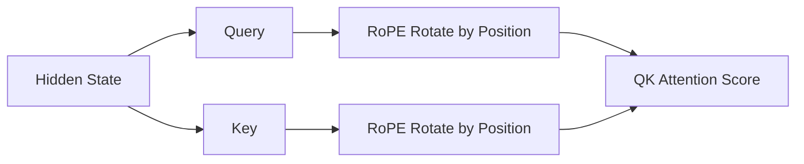

# 位置编码

:::tip[目的]
这篇主要回答 3 个问题：
1. 为什么 Transformer 需要位置编码。
2. 常见位置编码方法有哪些、各有什么特点。
3. 位置编码为什么会影响 KV Cache、长上下文和推理配置。
:::

Transformer 的 Self-Attention 机制表达力很强，但它本身并不天然知道顺序。  

如果没有位置编码的机制，模型只能看到“有哪些 token”，却不知道“谁在前、谁在后、彼此相隔多远”。

位置编码的核心作用可以概括为：

> 让模型知道 token 在序列中的位置与相对关系。

在现代 LLM 里，位置编码会直接影响：

- 模型能否稳定利用长上下文。
- KV Cache 是否正确复用。
- 推理框架的配置是否和模型权重兼容。
- 长文本外推和部署效果是否异常。

---

## 1. 引入

### 1.1 从 Self-Attention 说起

Self-Attention 的公式是：

$$
\operatorname{Attention}(Q, K, V)
= \operatorname{softmax}\left(\frac{QK^\top}{\sqrt{d_k}}\right)V
$$

这里的相似度计算只关心 Query 和 Key 的匹配程度。  

如果输入向量里没有顺序信息，那么 Attention 只能知道 token 内容相不相关，不能知道它们的先后关系。

例如：

```text
狗 咬 人
人 咬 狗
```

这两句话包含的 token 集合相同，但顺序不同，语义完全不同。  

如果模型分不清顺序，就很难理解谁是动作发起者、谁是动作承受者。

因此，Transformer 需要一个额外机制，把“位置信息”注入到 Attention 或输入表示里，这就是位置编码。

### 1.2 解决什么问题

位置编码主要处理三类问题：

| 问题 | 说明 |
| :---: | :---: |
| 绝对位置 | 当前 token 是第几个位置 |
| 相对位置 | 两个 token 相隔多远、谁在谁前面 |
| 长度泛化 | 训练时见过 4K，推理时能否处理 32K 或更长 |

从语言理解和生成的角度看，相对位置通常比绝对位置更关键，因为模型往往更关心依赖关系、距离和结构，而不只是关心一个 token 的编号。

模型很多时候并不需要强依赖“这是第 127 个 token”，而更需要知道“这个词离它关注的词有多远，它们之间是什么关系”。

---

## 2. 方法谱系

### 2.1 绝对位置编码

最直观的表示绝对位置的方法是：给每个位置一个向量作为位置编码，再加到 token embedding 上作为整体的输入

```text
input_vector = token_embedding + position_embedding
```

例如：

| 位置 | position embedding |
| :---: | :---: |
| 0 | `p0` |
| 1 | `p1` |
| 2 | `p2` |

这样同一个 token 出现在不同位置时，输入表示就不同了。

这种做法的优点是直观、实现简单，并且训练长度内表达能力通常不错。

而局限也很大：

- 最大位置通常是固定的。
- 超出训练位置后，外推能力较弱。
- 更偏绝对位置，不够强调相对距离。

### 2.2 Sinusoidal PE

原始 Transformer 使用的是 Sinusoidal PE (*正弦余弦位置编码*) - 利用不同频率的 `sin / cos` 函数生成位置向量。

可以把它粗略理解成：

```text
position 0 -> [sin/cos pattern]
position 1 -> [slightly shifted pattern]
position 2 -> [another shifted pattern]
```

它的特点是：

- 不使用可学习的位置 embedding，每个位置都有确定编码，位置信息由固定的正余弦函数构造，而不是训练出来。
- 不同频率可以同时表达局部和长距离变化。
- 理论上可以扩展到更长位置。

正弦余弦位置编码对于早期的 Transformer 很重要。

### 2.3 RoPE

在现代 Decoder-only LLM 中，更常见的是 RoPE (Rotary Position Embedding *旋转位置编码* )，比如 LLaMA、Qwen、Mistral、DeepSeek 等大量模型家族都采用了它。

RoPE 不显式地给 token 加位置向量，而是 **在 Attention 中对 Query 和 Key 做位置相关的旋转变换 - 第 k 个位置上的 Query 和 Key 表示，要按位置 k 做旋转**。

通过这种处理，每个位置 k 的 Q/K 都用了对应的旋转 R(k)，所以它们带有位置依赖，而 Q 和 K 的内积会以一种特别自然的方式依赖相对位置差。

示意如下：



**RoPE 的关键直觉**在于：

- token 的内容信息主要由 Q/K 承载。
- 通过对 Q/K 施加位置相关的旋转变换引入位置信息，来自于旋转后 Q/K 内积的 attention 分数自然反映不同位置间的相对关系。

**RoPE 还有一系列工程优势**：

- 不必为每个绝对位置单独学习 embedding。
- 更适合在 Attention 里表达相对位置信息。
- 对自回归生成和 KV Cache 友好。
- 有相对成熟的长上下文 scaling 方案。

### 2.4 ALiBi

ALiBi (Attention with Linear Biases) 同样不显式地给 token 加位置向量，而是直接在 attention score 上加入和距离相关的线性偏置。

直觉上可以理解为：

```text
距离越远，attention score 被扣得越多
```

例如：

| 距离 | bias |
| :---: | :---: |
| 1 | -0.1 |
| 10 | -1.0 |
| 100 | -10.0 |

**ALiBi 的特点**是：

- 机制简单。
- 对长上下文外推相对友好。
- 不使用可学习的位置 embedding。
- 通过 attention bias 直接表达“距离惩罚”。

**ALiBi 和 RoPE 的核心思想**可以分别概括为：

- RoPE：通过旋转 Q/K 注入相对位置信息。
- ALiBi：通过 attention bias 表达距离惩罚。

---

## 3. 工程相关

### 3.1 位置编码与 KV Cache

位置编码会直接影响 KV Cache 的正确性。  

**以 RoPE 为例**：  

Key 在写入缓存前已经带上了对应位置的旋转信息；后续生成时，新 token 的 Query 应该使用正确位置的旋转，再去和历史 Key 做 attention。

如果位置编号错了，就会出现“缓存内容没错，但位置关系错了”的问题，结果通常不是直接报错，而是输出质量明显异常。

**常见问题**包括：

- 继续生成时 `position_ids` 没有接上。
- 多轮对话拼接后位置偏移错误。
- 左 padding 和右 padding 的位置处理不一致。
- 截断或滑动窗口后没有正确重算位置。
- speculative decoding 或并行解码里的位置处理不一致。

所以在推理框架里，`position_ids`、`attention_mask` 和 `KV Cache` 必须严格对齐。

### 3.2 长上下文与位置外推

长上下文不只是“显存够不够”的问题，也和位置编码密切相关。

如果模型训练时最大上下文是 4K，而推理时直接喂 32K，那么模型会遇到训练阶段没见过的位置范围。不同位置编码方法，对这种“位置外推”的支持能力不同。

常见现象包括：

- 远距离信息利用不稳定。
- 注意力分布异常。
- 中间或后部内容更容易被忽略。
- 长文档问答质量明显下降。
- Needle in a Haystack 这类测试表现变差。

所以长上下文能力通常不是单靠一项配置堆出来的，而是训练长度、位置编码、数据配比和推理实现共同作用的结果。

### 3.3 RoPE Scaling

RoPE scaling 是扩展 RoPE 上下文长度的一类方法。  
它的核心思路是调整“位置 -> 旋转角度”的映射，让更长输入仍落在模型更可处理的频率范围内。

常见思路包括：

- 线性缩放位置。
- 调整 `rope_theta`。
- 对不同频率维度采用不同缩放策略。
- 结合长上下文继续训练或校准。

但要注意，RoPE scaling 不是“把配置改大”就自动生效。  
如果只是改 `rope_scaling`、`max_position_embeddings` 或 `rope_theta`，但模型没做相应训练或校准，那么更常见的结果只是“能跑更长输入”，不代表“能稳定理解更长上下文”。

---

## 4. 常见误区

#### Transformer 天然懂顺序

不是。Self-Attention 本身不包含顺序信息，必须通过位置编码或类似机制注入。

#### RoPE scaling 一定无损

不是。RoPE scaling 本质上是工程折中，效果高度依赖模型、缩放方法、训练数据和推理实现。

#### 长上下文能解决所有记忆问题

不能。长上下文只是一次请求内的输入容量，不等于长期记忆。跨会话记忆仍然需要检索、摘要、外部存储和状态管理。

#### 位置编码只影响训练，不影响推理

不是。  推理阶段的 `position_ids`、padding、KV Cache、截断和滑动窗口都和位置处理直接相关。

---

## 5. 小结

位置编码的本质，是让 Transformer 模型不只看到 token 内容，还能感知顺序和距离。

从方法上看：

- **绝对位置编码** 增加可学习的位置 embedding，最直观但外推能力往往一般。
- **Sinusoidal PE** 利用正余弦函数构造位置向量，是早期经典方案。
- **RoPE** 引入位置旋转变换，是现代 LLM 中最常见的方案之一。
- **ALiBi** 通过 attention bias 表达距离惩罚，也常被拿来讨论长上下文外推。

从工程上看，位置编码还会涉及 KV Cache、长上下文、RoPE scaling 和推理配置等方面。
