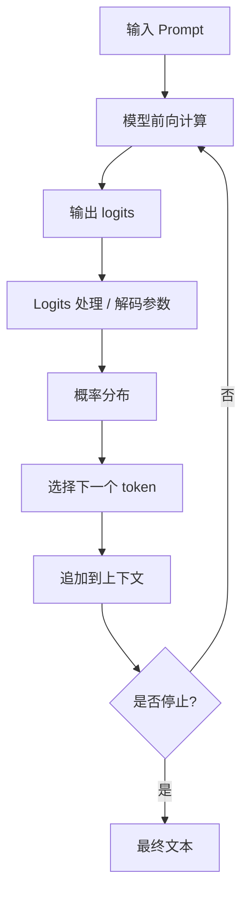

# 生成与解码

大语言模型每一步都会输出“下一个 token 的概率分布”。解码就是从这个概率分布中选择 token，并把选中的 token 追加回上下文，继续生成后续 token 的过程。

一句话概括：

> 解码策略决定模型如何从概率分布变成最终文本。

同一个模型、同一个 prompt，在不同解码参数下可能输出完全不同的结果。理解 greedy、sampling、temperature、top_p、top_k、beam search、repetition penalty 和 stop token，是正确使用 LLM 的基础。

---

## 生成的基本流程

生成过程是逐 token 进行的。



每一步通常包括：

1. 模型根据当前上下文输出 logits。
2. 系统根据 temperature、top_p、top_k 等参数处理 logits。
3. 将 logits 转成概率分布。
4. 用 greedy 或 sampling 等策略选择 token。
5. 把 token 追加到上下文。
6. 检查是否遇到停止条件。

所以，模型不是一次性写出整段回答，而是一步一步生成。

---

## Greedy Decoding

Greedy decoding 是最简单的解码策略：每一步都选择概率最高的 token。

例如当前概率分布是：

| token | 概率 |
| --- | ---: |
| `北京` | 0.82 |
| `上海` | 0.08 |
| `中国` | 0.04 |
| `首都` | 0.02 |

Greedy 会选择 `北京`。

### 优点

- 输出稳定。
- 可复现性强。
- 适合确定性任务。
- 推理实现简单。

### 缺点

- 容易死板。
- 可能陷入重复。
- 对开放式创作不够自然。
- 局部最优不一定带来全局最优。

适合场景：

- 信息抽取。
- 分类。
- 格式转换。
- 代码修复。
- 数据清洗。
- 结构化输出。

---

## Sampling

Sampling 是按概率分布随机抽样。

如果概率分布是：

| token | 概率 |
| --- | ---: |
| `北京` | 0.82 |
| `上海` | 0.08 |
| `中国` | 0.04 |

Sampling 大多数时候会选 `北京`，但也可能选 `上海` 或其他 token。

### 为什么需要 Sampling

语言生成不总是只有一个正确答案。

例如：

```text
写一个关于春天的开头。
```

模型可以有很多合理写法。如果每次都选最高概率 token，输出可能过于保守。Sampling 让模型能探索更多表达。

适合场景：

- 创意写作。
- 头脑风暴。
- 多方案生成。
- 对话风格变化。
- 文案和标题生成。

不适合场景：

- 严格 JSON。
- 代码补丁。
- SQL 生成。
- 金融/法律/医疗等高风险事实回答。
- 需要稳定复现的测试任务。

---

## Temperature

Temperature 控制概率分布的尖锐程度。

简化理解：

- 低 temperature：高概率 token 更突出，输出更稳定。
- 高 temperature：低概率 token 更容易被采到，输出更发散。

| Temperature | 直觉效果 | 适合场景 |
| --- | --- | --- |
| 0 或接近 0 | 接近 greedy，稳定保守 | 抽取、分类、代码、结构化输出 |
| 0.2 - 0.5 | 稳定但略有变化 | 问答、总结、说明文 |
| 0.6 - 0.9 | 更自然、更开放 | 创意写作、头脑风暴 |
| 1.0 以上 | 更随机，风险更高 | 多样化探索，不适合严肃任务 |

Temperature 不是“质量”或“智商”参数。它只改变采样分布，不会让模型知道更多事实，也不会修复推理错误。

---

## Top-p / Nucleus Sampling

Top-p 又叫 nucleus sampling。

它会从概率最高的 token 开始累加，保留累计概率达到 `p` 的最小候选集合，然后只在这个集合里采样。

例如概率分布：

| token | 概率 | 累计概率 |
| --- | ---: | ---: |
| A | 0.50 | 0.50 |
| B | 0.25 | 0.75 |
| C | 0.12 | 0.87 |
| D | 0.08 | 0.95 |
| E | 0.05 | 1.00 |

如果 `top_p = 0.9`，候选集合会保留 A、B、C、D，因为累计到 D 才超过 0.9。

Top-p 的特点：

- 模型很确定时，候选集合小。
- 模型不确定时，候选集合变大。
- 比固定 top_k 更自适应。

常见设置：

| top_p | 效果 |
| --- | --- |
| 0.8 | 候选更窄，输出更稳 |
| 0.9 | 常用折中 |
| 0.95 | 更多变化 |
| 1.0 | 不限制 nucleus |

---

## Top-k

Top-k 只保留概率最高的 k 个 token，然后在其中采样。

例如 `top_k = 3`：

| token | 概率 | 是否保留 |
| --- | ---: | --- |
| A | 0.50 | 是 |
| B | 0.25 | 是 |
| C | 0.12 | 是 |
| D | 0.08 | 否 |
| E | 0.05 | 否 |

Top-k 的优点是简单可控，缺点是不够自适应。

如果模型很确定，前 3 个 token 可能已经太多；如果模型很不确定，前 3 个 token 又可能太少。

实际使用中，top_p 比 top_k 更常见，但一些推理框架会同时支持两者。

---

## Temperature、Top-p、Top-k 的关系

这三个参数都影响采样，但作用位置不同。

| 参数 | 作用 | 直觉 |
| --- | --- | --- |
| temperature | 调整概率分布尖锐程度 | 让分布更保守或更发散 |
| top_p | 按累计概率截断候选集合 | 保留核心概率质量 |
| top_k | 按数量截断候选集合 | 只看前 k 个 token |

常见实践：

- 稳定任务：低 temperature，低 top_p 或直接 greedy。
- 创作任务：中等 temperature，较高 top_p。
- 严格格式任务：尽量降低随机性，并配合 schema / parser。

不要盲目同时把 temperature、top_p、top_k 调得很激进，否则很难判断输出变化来自哪里。

---

## Beam Search

Beam search 会同时保留多个候选序列，而不是每一步只保留一个 token。

例如 beam size = 3，模型会维护 3 条当前得分最高的候选路径：

```text
路径 A: 今天天气很好
路径 B: 今天的天气不错
路径 C: 今天阳光很好
```

每一步扩展这些路径，再保留总分最高的若干条。

### 优点

- 比 greedy 更不容易被单步局部选择限制。
- 在翻译、摘要等传统 seq2seq 任务中常见。
- 可以寻找整体概率较高的序列。

### 缺点

- 推理成本更高。
- 输出可能更保守。
- 对开放式对话和创作未必更好。
- 在现代聊天 LLM 中不如 sampling 常用。

Beam search 更适合有明确目标、候选答案相对受限的任务；不一定适合自由对话。

---

## Repetition Penalty

Repetition penalty 用来降低重复 token 或重复片段的概率。

大模型有时会出现重复：

```text
这个问题的关键是安全。安全非常重要，因为安全是安全的基础...
```

Repetition penalty 会对已经出现过的 token 或 n-gram 做惩罚，让模型更倾向选择新内容。

相关参数可能包括：

| 参数 | 含义 |
| --- | --- |
| repetition_penalty | 惩罚已经出现过的 token |
| frequency_penalty | 出现频次越高惩罚越大 |
| presence_penalty | 只要出现过就惩罚 |
| no_repeat_ngram_size | 禁止重复 n-gram |

这些参数可以缓解重复，但设置过强会导致输出不自然，甚至破坏术语、代码和固定格式。

---

## Stop Token 与 Stop Sequence

生成不能无限继续，系统需要停止条件。

常见停止方式：

| 停止条件 | 说明 |
| --- | --- |
| EOS token | 模型生成结束 token |
| max_tokens | 达到最大输出 token 数 |
| stop sequence | 命中特定字符串，例如 `</answer>` |
| 工具调用边界 | 生成 tool call 后停止，交给工具执行 |
| 安全策略 | 内容被策略拦截 |
| 用户中断 | 用户主动停止 |

Stop sequence 在结构化输出和多轮协议里很有用。

例如要求模型输出：

```text
<answer>
...
</answer>
```

可以把 `</answer>` 设置为 stop sequence，让模型在结束标签后停止。

---

## 为什么同一个问题每次回答可能不同

主要原因是 sampling。

当 temperature 大于 0，并且启用了采样时，每一步 token 都可能在候选集合中随机选择。即使前几步只差一个 token，后续上下文也会变化，最终回答可能明显不同。

影响复现性的因素包括：

- temperature。
- top_p / top_k。
- 随机种子 seed。
- 模型版本。
- 推理框架实现。
- 并发和浮点计算细节。
- 是否启用 speculative decoding。

如果需要更强复现性，应使用低 temperature 或 greedy，并固定模型版本、prompt、seed 和推理参数。

---

## 解码与事实正确性

解码参数会影响输出风格和稳定性，但不能从根本上保证事实正确。

低 temperature 可以让模型更稳定，但如果模型已经走在错误事实上，它会稳定地输出错误。

高 temperature 可以带来更多创意，但也会增加编造细节的概率。

事实类任务更应该依赖：

- 检索和引用。
- 工具调用。
- 数据库查询。
- 结构化校验。
- 多轮验证。
- 让模型明确区分已知和未知。

解码参数只能调节“如何说”，不能替代“如何知道”。

---

## 结构化输出的解码策略

结构化输出包括 JSON、XML、SQL、代码、表格等。

这类任务通常要求稳定、格式正确、可解析。

建议：

- 使用低 temperature。
- 尽量关闭高随机性 sampling。
- 使用 JSON mode、schema constrained decoding 或 function calling。
- 设置明确 stop sequence。
- 生成后用 parser 校验。
- 校验失败时让模型修复，而不是直接信任输出。

仅靠 prompt 写“请严格输出 JSON”不够可靠。工程上要用解码约束和后处理校验兜底。

---

## 不同任务的参数建议

| 任务 | 建议策略 |
| --- | --- |
| 分类 / 判断 | greedy 或低 temperature |
| 信息抽取 | 低 temperature + schema 校验 |
| 代码生成 | 低到中 temperature，配合测试 |
| SQL 生成 | 低 temperature + 语法/权限校验 |
| 总结 | 低到中 temperature |
| 开放问答 | 中等 temperature |
| 创意写作 | 中高 temperature + 较高 top_p |
| 多方案头脑风暴 | 采样，多次生成 |
| RAG 问答 | 低到中 temperature + 引用来源 |
| Agent 工具调用 | 低 temperature + 工具 schema + guardrails |

这些不是固定规则，而是起点。最终应根据评测集和线上反馈调整。

---

## 与推理性能的关系

解码策略也会影响推理成本。

| 策略 | 性能影响 |
| --- | --- |
| Greedy | 通常最简单 |
| Sampling | 开销很小，主要多 logits 处理 |
| Beam search | 成本随 beam size 增加 |
| 长输出 | decode 轮数增加，耗时上升 |
| 高 max_tokens | 可能导致尾部无效生成成本 |
| 多候选生成 | 成本按候选数放大 |

在服务化场景中，要限制：

- 最大输出 token 数。
- 单请求生成候选数量。
- 超时时间。
- 是否允许 beam search。
- 是否允许高随机性参数。

否则很容易出现成本不可控和长尾延迟。

---

## 常见误区

### Temperature 越高越聪明

不是。Temperature 只提高随机性，不提高模型能力。

### Temperature 设为 0 就不会错

不是。它只让输出更确定，不能保证事实正确。

### Top-p 越大越好

不是。Top-p 越大，候选越多，输出越发散。严肃任务通常不需要很高 top_p。

### Beam search 一定比 greedy 好

不一定。Beam search 找的是高概率序列，不等于更符合用户需求。开放式任务里它可能更无聊。

### 重复惩罚越强越好

不是。过强惩罚会破坏专业术语、代码变量名、列表格式和必要重复。

---

## 小结

生成与解码连接了模型概率分布和最终文本输出。

模型每一步输出 logits，经过 temperature、top_p、top_k、repetition penalty 等处理后，系统用 greedy、sampling 或 beam search 等策略选择下一个 token。这个 token 再被追加到上下文，影响后续生成。

正确理解解码后，可以解释：

- 为什么同一 prompt 会输出不同答案。
- 为什么低 temperature 更稳定但不保证正确。
- 为什么创作任务需要采样。
- 为什么结构化输出需要 schema 和 parser。
- 为什么 stop token、max_tokens 会影响回答完整性。
- 为什么长输出会增加成本和延迟。

解码参数是产品体验的一部分。它们应该根据任务类型、风险等级和评测结果来配置，而不是凭感觉调。
