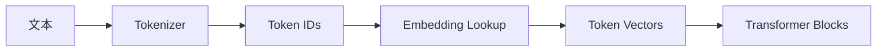
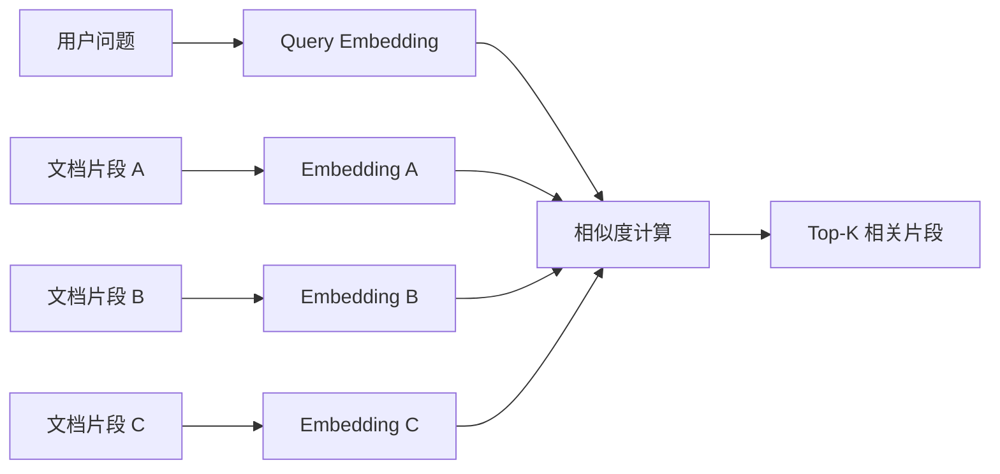
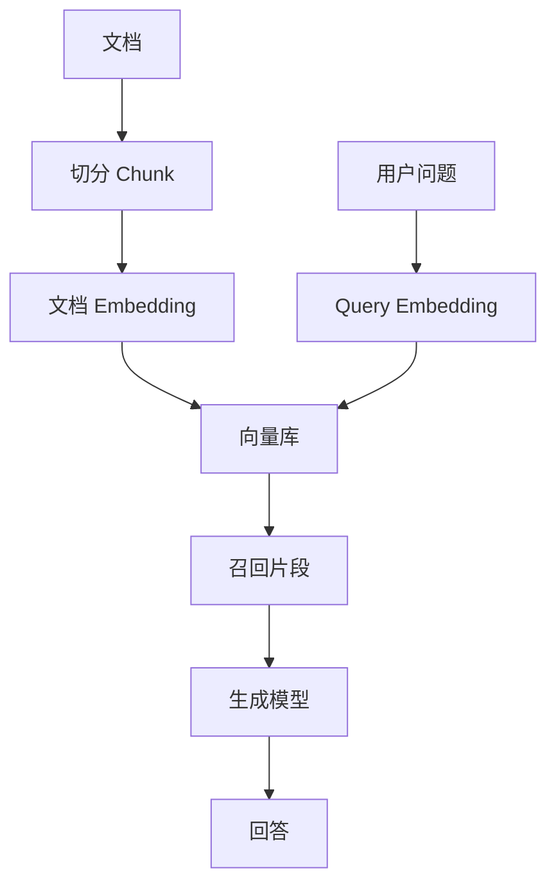

# 词向量与 Embedding

大语言模型不能直接计算文字。文字会先被 tokenizer 切成 token，再被映射成 token id。但 token id 只是离散编号，本身不表达语义。Embedding 的作用，就是把这些离散编号转换成模型可以计算的连续向量。

一句话概括：

> Embedding 是把离散对象映射到连续向量空间的方法。

在 LLM 里，embedding 主要有两种常见含义：

- 模型内部的 token embedding：把 token id 变成 Transformer 可以处理的向量。
- 检索系统里的 text embedding：把文本片段变成语义向量，用于相似度搜索、聚类和推荐。

这两者都叫 embedding，但用途和训练目标不同，不能混为一谈。

---

## 为什么 Token ID 不能直接表达语义

Tokenizer 会把文本变成 token id：

```text
文本:   猫 喜欢 鱼
Token: ["猫", " 喜欢", " 鱼"]
ID:    [1357, 2468, 9753]
```

这些 ID 只是词表中的编号。编号之间的大小关系没有语义。

例如：

```text
猫 = 1357
狗 = 1358
银行 = 1359
```

这不代表“猫”和“狗”只差 1 就更相似，也不代表“银行”与它们距离接近。token id 只是索引，不是语义坐标。

如果直接把 token id 当数字输入模型，模型会误以为编号大小、差值、顺序有数学意义。Embedding lookup 解决的就是这个问题：每个 token id 对应一条可学习的向量。

---

## Embedding Lookup

Embedding lookup 可以理解为查表。

模型维护一个 embedding 矩阵。每个 token id 对应矩阵中的一行。

```text
token_id -> embedding_matrix[token_id] -> vector
```

假设词表大小是 50,000，hidden size 是 4，那么 embedding 矩阵可以想象成：

| token id | embedding vector |
| --- | --- |
| 0 | `[0.12, -0.03, 0.44, 0.09]` |
| 1 | `[-0.20, 0.31, 0.05, 0.77]` |
| 2 | `[0.88, -0.14, 0.10, -0.25]` |
| ... | ... |

真实模型的 hidden size 通常远大于 4，可能是 768、2048、4096、8192 或更高。



Embedding lookup 本身不是复杂计算，它更像“按 token id 取出对应向量”。复杂计算发生在后面的 Transformer 层。

---

## Embedding 矩阵

Embedding 矩阵的形状通常是：

```text
vocab_size x hidden_size
```

例如：

| 参数 | 示例 |
| --- | --- |
| vocab_size | 50,000 |
| hidden_size | 4096 |
| embedding 参数量 | 50,000 × 4096 = 204,800,000 |

这说明 embedding 层本身也会占用大量参数。

### vocab_size

`vocab_size` 是词表大小，也就是模型能直接表示多少个 token。词表越大，embedding 矩阵行数越多。

### hidden_size

`hidden_size` 是每个 token 向量的维度。它决定了 Transformer 内部每个位置的表示宽度。

如果一个模型 hidden size 是 4096，那么每个 token 在进入 Transformer 前，会被表示成一个 4096 维向量。

---

## 向量空间中的相似性

Embedding 的直觉是：语义或用法相近的对象，在向量空间中应该更接近。

例如，一个训练良好的语义 embedding 空间中：

- “猫”和“狗”可能更近。
- “北京”和“上海”可能更近。
- “显存”和“GPU”可能更近。
- “合同审查”和“法律条款”可能更近。

常见相似度计算方式包括：

| 方法 | 含义 |
| --- | --- |
| Cosine similarity | 看两个向量方向是否接近 |
| Dot product | 看两个向量点积大小 |
| Euclidean distance | 看两个向量几何距离 |

RAG 和向量检索里最常见的是 cosine similarity 或 dot product。

---

## Cosine Similarity

Cosine similarity 计算两个向量夹角的余弦值。

```text
cosine(a, b) = dot(a, b) / (||a|| * ||b||)
```

如果两个向量方向很接近，cosine similarity 接近 1；如果方向差异很大，则接近 0 或负数。

在语义检索里，用户 query 和文档 chunk 都会先变成 embedding。系统再找与 query embedding 最接近的文档 embedding。



这就是向量检索的基本原理。

---

## 输入 Embedding 与位置编码

只把 token 映射成向量还不够。模型还需要知道 token 在序列中的位置。

例如：

```text
狗咬人
人咬狗
```

这两句话包含相同 token，但顺序不同，含义完全不同。

因此，Transformer 输入通常包含两类信息：

- token embedding：表示“这个位置是什么 token”。
- position information：表示“这个 token 在序列中的哪个位置”。

不同模型使用不同位置编码方式，例如绝对位置编码、RoPE、ALiBi 等。它们的共同目标是让模型能够感知顺序和相对位置。

```text
input vector = token embedding + position information
```

严格来说，RoPE 这类方法不是简单相加，但从直觉上可以理解为：模型输入不仅要知道 token 内容，还要知道 token 位置。

---

## Hidden State 与 Token Embedding 的区别

Token embedding 是进入模型前的初始表示。Hidden state 是经过 Transformer 层处理后的上下文表示。

| 概念 | 位置 | 是否包含上下文 |
| --- | --- | --- |
| Token embedding | 输入层 | 不包含或几乎不包含上下文 |
| Hidden state | Transformer 中间层 / 输出层 | 包含上下文 |

同一个 token 在不同句子里，初始 token embedding 是一样的，但经过 Transformer 后的 hidden state 会不同。

例如 token `苹果`：

```text
我买了一斤苹果。
苹果发布了新芯片。
```

输入层的 `苹果` token embedding 可能相同，但在第一句中它会更像水果，在第二句中会更像公司。这个上下文区分主要由 Transformer 层完成，而不是静态 token embedding 本身完成。

---

## 输入 Embedding 与输出 LM Head

生成模型最后要预测下一个 token。模型会把最后位置的 hidden state 转成对整个词表的 logits。


LM Head 通常是一个线性层，形状大致是：

```text
hidden_size x vocab_size
```

它把 hidden state 映射回词表空间，为每个 token 产生一个 logit。

很多语言模型会使用 weight tying，也就是让输入 embedding 矩阵和输出 LM Head 共享权重或相关参数。直觉上，模型既要把 token 映射进向量空间，也要从向量空间映射回 token。

---

## 语义 Embedding 模型

除了生成模型内部的 token embedding，工程中更常说的 embedding 往往是“文本语义向量”。

语义 embedding 模型会把一段文本映射成一个固定长度向量：

```text
"如何部署 vLLM？" -> [0.013, -0.284, ..., 0.117]
```

这个向量通常用于：

- 语义搜索。
- RAG 文档召回。
- 文本聚类。
- 推荐系统。
- 去重。
- 相似问题匹配。
- 分类和路由。

语义 embedding 模型的输出通常是句子级、段落级或文档片段级向量，而不是每个 token 一个向量。

---

## Token Embedding 与 Text Embedding 的区别

| 维度 | Token embedding | Text embedding |
| --- | --- | --- |
| 所属系统 | 生成模型内部 | 检索、RAG、推荐、聚类系统 |
| 输入 | token id | 一段文本 |
| 输出 | 每个 token 一个向量 | 整段文本一个向量 |
| 是否直接给用户用 | 通常不直接使用 | 经常作为 API 输出 |
| 训练目标 | 支持语言建模 | 支持语义相似、检索或对比学习 |
| 典型用途 | Transformer 输入 | 向量检索、语义匹配 |

这两个概念都叫 embedding，但工程上要分清楚。

当你调用 embedding API 得到一个向量时，它通常不是模型内部某个 token 的输入 embedding，而是经过专门训练的语义表示。

---

## RAG 中的 Embedding

RAG 系统中，embedding 常用于召回相关文档。

基本流程：

1. 把文档切成 chunk。
2. 用 embedding 模型把每个 chunk 转成向量。
3. 把向量写入向量库。
4. 用户提问时，把问题也转成向量。
5. 在向量库中搜索最相似的 chunk。
6. 把召回内容放进生成模型上下文。



RAG 里的 embedding 不负责生成答案，它负责“找材料”。生成答案仍由 LLM 完成。

---

## 为什么 Embedding 检索会失败

Embedding 检索很有用，但不是万能的。

常见失败原因：

### 1. Chunk 切分不合理

如果 chunk 太短，语义不完整；如果 chunk 太长，向量会混合多个主题，检索不准。

### 2. Query 和文档表达不一致

用户问“怎么降低首 token 延迟”，文档写的是 “TTFT 优化”。如果 embedding 模型没有很好捕捉这层同义关系，可能召回失败。

### 3. 专有名词和代码符号弱

Embedding 模型对自然语言语义通常更强，但对精确符号、ID、函数名、错误码、版本号可能不如关键词搜索稳定。

### 4. 语义相似但任务不匹配

两个文本语义接近，不代表它们能回答同一个问题。例如“vLLM 安装教程”和“vLLM 性能调优”都和 vLLM 相关，但用户问题不同，需要的文档不同。

### 5. 向量相似度不等于事实正确

向量库只能召回“相似内容”，不能保证内容是最新、权威、完整或正确的。

因此，实际 RAG 往往会结合：

- 向量检索。
- 关键词检索。
- metadata filter。
- rerank。
- 权限过滤。
- 引用和溯源。
- 生成后校验。

---

## Embedding 维度越高越好吗

不一定。

更高维度可以表达更复杂的信息，但也会带来：

- 更高存储成本。
- 更高检索计算成本。
- 更高索引内存占用。
- 更慢的向量库构建和查询。

选择 embedding 模型时，不能只看维度，还要看：

| 指标 | 说明 |
| --- | --- |
| 任务效果 | 在你的数据和 query 上召回是否好 |
| 语言覆盖 | 中文、英文、代码、专业术语是否适配 |
| 上下文长度 | 能否处理你的 chunk 长度 |
| 向量维度 | 存储和检索成本 |
| 速度 | 批量入库和在线查询延迟 |
| 成本 | API 或自部署推理成本 |

工程上最重要的是用自己的数据做召回评测。

---

## Embedding 与分类、聚类

Embedding 不只用于 RAG，也常用于分类和聚类。

### 分类

可以把文本转成 embedding，再用一个简单分类器做意图识别、主题分类、风险分类。

```text
文本 -> embedding -> classifier -> 类别
```

### 聚类

把大量文本转成 embedding 后，可以按向量距离聚类，发现相似问题、重复工单、用户反馈主题或知识库空白。

### 去重

相似度高的文本可能是重复问题、重复文档或同一事件的不同表述。Embedding 可以作为语义去重的基础。

---

## 常见误区

### Embedding 就等于语义

不完全是。Embedding 是模型学到的表示，通常包含语义信息，但也可能受到训练数据、任务目标、语言分布和模型结构影响。

### 向量相似就一定相关

不一定。向量相似表示模型认为表达接近，但不保证能回答用户问题，也不保证事实正确。

### RAG 只要有 embedding 就够了

不够。RAG 还需要 chunk、metadata、hybrid search、rerank、上下文压缩、引用、权限和评估。

### 生成模型的 token embedding 可以直接拿来做检索

通常不建议。生成模型内部 embedding 的训练目标是语言建模，不一定适合语义检索。工程上一般使用专门训练的 embedding 模型。

### 维度越大效果越好

不一定。更大维度可能提升表达能力，也可能只是增加成本。最终要看实际召回效果。

---

## 小结

Embedding 是连接离散文本和连续计算空间的桥。

在 LLM 内部，token embedding 把 token id 变成 Transformer 可以处理的向量；经过多层 Transformer 后，模型得到包含上下文的 hidden state，并用 LM Head 预测下一个 token。

在 RAG 和搜索系统中，text embedding 把问题和文档片段变成语义向量，用相似度搜索找相关材料。

理解 embedding 后，可以更好地理解：

- 为什么 token id 本身不表达语义。
- 为什么模型需要 hidden size。
- 为什么同一个词在不同上下文中含义不同。
- 为什么 RAG 需要向量库和相似度搜索。
- 为什么 embedding 检索有用但不等于事实校验。
- 为什么工程上要区分 token embedding 和 text embedding。
