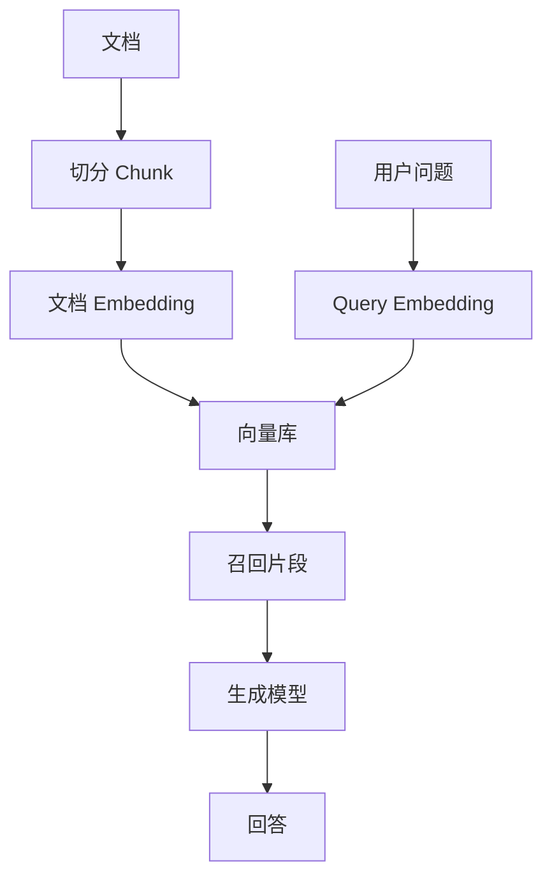

# 词向量与 Embedding

:::tip[目的]
1. 理解 Embedding 如何把离散的 token id 变成模型可以计算的向量。
2. 理解向量如何进入 Transformer、形成 hidden state，并通过 LM Head 转成下一个 token 的 logits。
3. 区分两个概念：LLM 内部的 token embedding，和 RAG / 检索系统中面向整段文本的 text embedding。
:::

在进入大语言模型之前，文本会先被 tokenizer 切成 token，再被映射到 token id。

但 token id 只是离散编号，本身不表达语义。Embedding 的作用，就是把这些离散编号转换成模型可以计算的连续向量。

概括来讲：

> Embedding 是把离散对象映射到连续向量空间的方法。

本篇可以视为 "**Token 与概率**" 篇中 "**处理 Token 的完整流程** - **模型根据 token ids 计算下一个 token 的 logits**" 的展开。

---

## 1. Token ID 并不直接表达语义

Tokenizer 会把文本切分成 token ，并匹配对应的 token id：

```text
文本:   猫 喜欢 鱼
Token 序列: ["猫", " 喜欢", " 鱼"]
ID 序列:    [1357, 2468, 9753]
```

这些 ID 只是词表中的编号，编号之间的大小关系没有语义。

例如：

```text
猫 = 1357
狗 = 1358
银行 = 1359
```

这不代表“猫”和“狗”只差 1 就更相似，也不代表“银行”与它们距离接近。token id 只是索引，不是语义表示。

---

## 2. Embedding Lookup

把索引跟语义联系起来需要的是 Embedding lookup - 通过 token id 对应一个可学习的向量。

Embedding lookup 可以理解为查表：模型一般会维护一个 embedding 向量矩阵，每个 token id 对应矩阵中的一行(即一个向量)。

```text
token_id -> embedding_matrix[token_id] -> vector
```

假设词表大小是 50,000，hidden size 是 4，那么 embedding 矩阵可以想象成：

| token id | embedding vector |
| :---: | :---: |
| 0 | `[0.12, -0.03, 0.44, 0.09]` |
| 1 | `[-0.20, 0.31, 0.05, 0.77]` |
| 2 | `[0.88, -0.14, 0.10, -0.25]` |
| ... | ... |
| 49,999 | `[0.81, 0.24, -0.15, -0.47]` |

真实模型的 hidden size 通常远大于 4，可能是 768、2048、4096、8192 或更高。


Embedding lookup 本身不是复杂计算，它更像“按 token id 取出对应向量”。

---

## 3. Embedding 矩阵

### 矩阵的形状
Embedding 矩阵的形状通常是：

```text
vocab_size x hidden_size
```
- `vocab_size` 是词表大小，也就是模型能直接表示多少个 token。词表越大，embedding 矩阵行数越多。
- `hidden_size` 是每个 token 向量的维度，它决定了 Transformer 内部每个位置的表示宽度。如果一个模型 hidden size 是 4096，那么每个 token 在进入 Transformer 前，会被表示成一个 4096 维向量。

例如：

| 参数 | 示例值 |
| :---: | :---: |
| vocab_size | 50,000 |
| hidden_size | 4096 |
| embedding 矩阵参数量 | 50,000 × 4096 = 204,800,000 |

这说明 embedding 层本身也会占用大量参数。

### 矩阵的值

Embedding 矩阵的具体值是通过模型训练得到。

- 在模型训练开始时，矩阵里的数值通常是随机初始化的。
- 训练过程中，模型不断做下一个 token 预测：预测错了，就根据 loss 通过反向传播调整参数，embedding 矩阵也会一起被更新。
- 经过大量训练后，经常在相似上下文中出现、用法接近的 token 的向量会逐渐得到更接近的表示，最终就获得了 Embedding 矩阵。

可以简单理解为：

```text
Embedding 矩阵 : 随机向量 -> 训练中不断调整 -> 学到可用于语言建模的 token 表示
```

---

## 4. 向量空间中的相似性

Embedding 的直觉是：语义或用法相近的对象，在向量空间中应该更接近。

例如，一个训练良好的语义 embedding 空间中：

- “猫”和“狗”可能更近。
- “北京”和“上海”可能更近。
- “显存”和“GPU”可能更近。
- “合同审查”和“法律条款”可能更近。

常见相似度度量方式包括：

| 方法 | 含义 |
| :---: | :---: |
| Cosine similarity *余弦相似度* | 看两个向量方向是否接近 |
| Dot product *点积/内积* | 看两个向量点积大小 |
| Euclidean distance *欧式距离* | 看两个向量几何距离 |

RAG 和向量检索里最常见的是 cosine similarity 或 dot product。

### Cosine Similarity *余弦相似度*

Cosine similarity 计算两个向量夹角的余弦值。

```text
cosine(a, b) = dot(a, b) / (||a|| * ||b||)
```

如果两个向量方向很接近，cosine similarity 接近 1；如果方向差异很大，则接近 0 或负数。

---

## 5. 输入 Embedding 与位置编码

只把 token 映射成向量还不够。模型还需要知道 token 在序列中的位置。

例如：

```text
狗咬人
人咬狗
```

这两句话包含相同 token，但顺序不同，含义完全不同。

因此，Transformer 输入通常包含两类信息：

- token embedding：表示“这个位置是什么 token”。
- position information：表示“这个 token 在序列中的哪个位置”。

不同模型使用不同位置编码方式，例如绝对位置编码、RoPE、ALiBi 等。它们的共同目标是让模型能够感知顺序和相对位置。

```text
input vector = token embedding + position information
```

严格来说，RoPE 这类方法不是简单相加，但从直觉上可以理解为：模型输入不仅要知道 token 内容，还要知道 token 位置。

---

## 6. Hidden State 与 Token Embedding

Token embedding 是进入模型前的初始表示。Hidden state 是经过 Transformer 层处理后的上下文表示。

| 概念 | 位置 | 是否包含上下文 |
| :---: | :---: | :---: |
| Token embedding | 输入层 | 不包含或几乎不包含上下文 |
| Hidden state | Transformer 中间层 / 输出层 | 包含上下文 |

同一个 token 在不同句子里，初始 token embedding 是一样的，但经过 Transformer 后的 hidden state 会不同。

例如 token `苹果`：

```text
我买了一斤苹果。
苹果发布了新芯片。
```

输入层的 `苹果` token embedding 相同，但在第一句中它会更像水果，在第二句中会更像公司。

这个上下文区分主要由 Transformer 层完成，而不是静态 token embedding 本身完成。

---

## 7. LM Head

生成模型的核心任务是要预测下一个 token，所以模型要把最后位置的 hidden state 转成对整个词表的 logits。

这个时候就需要一个名为 LM Head 的层。


LM Head 通常是一个线性层，形状大致是：

```text
hidden_size x vocab_size
```

它把 hidden state 映射到词表空间，为每个 token 产生一个 logit。

很多语言模型会使用 weight tying，也就是让输入 embedding 矩阵和输出 LM Head 共享权重或相关参数。即直觉上，模型既要把 token 映射到向量空间，也要从向量空间映射回 token。

---

## 8. **Embedding 的完整流程**

在《Token 与概率》篇 **处理 token的完整流程** 中有一步是：

> 模型根据 token ids 计算下一个 token 的 logits。

这个过程可以进一步展开为三步：
1. token ids 通过 Embedding lookup 和 Embedding 矩阵 得到 token embeddings
2. Transformer 处理这些 embeddings 得到 hidden states
3. LM head 再把 hidden states 转成 logits。

---

## 9. Text Embedding

在 LLM 里，embedding 通常有两种常见含义：

- 模型内部的 token embedding：把 token id 变成 Transformer 架构模型可以处理的向量。
- 检索系统里的 text embedding：把文本片段变成语义向量，用于相似度搜索、聚类和推荐等。

两者都叫 embedding，但用途和训练目标不同，不能混为一谈。

即除了生成模型内部的 token embedding，工程中有时说的 embedding 是指 "text embedding *文本语义向量*"。

text embedding 会把一段文本映射成一个固定长度向量：

```text
"如何部署 vLLM？" -> [0.013, -0.284, ..., 0.117]
```

text embedding 通常用于：

- 语义搜索。
- RAG 文档召回。
- 文本聚类。
- 推荐系统。
- 去重。
- 相似问题匹配。
- 分类和路由。

text embedding 的输出通常是句子级、段落级或文档片段级向量，而不是每个 token 一个向量。

---

### 与 Token Embedding 的区别

| 维度 | Token embedding | Text embedding |
| :---: | :---: | :---: |
| 所属系统 | 生成模型内部 | 检索、RAG、推荐、聚类系统 |
| 输入 | token id | 一段文本 |
| 输出 | 每个 token 一个向量 | 整段文本一个向量 |
| 是否直接给用户用 | 通常不直接使用 | 经常作为 API 输出 |
| 训练目标 | 支持语言建模 | 支持语义相似、检索或对比学习 |
| 典型用途 | Transformer 输入 | 向量检索、语义匹配 |

这两个概念都叫 embedding，但工程上要分清楚。

<!--当你调用 embedding API 得到一个向量时，它通常不是模型内部某个 token 的输入 embedding，而是经过专门训练的语义表示。-->

---

### RAG 中的 Embedding

RAG 系统中，text embedding 常用于召回相关文档。

基本流程：

1. 文档切分：把文档切成 chunk。
2. 向量化：用 embedding 模型把每个 chunk 转成向量。
3. 向量存储：把向量写入向量数据库。
4. query embedding: 用户提问时，把 query text 也转成向量。
5. 召回 / 相似度匹配：在向量库中搜索最相似的向量，对应到 chunk。
6. 生成：把召回内容放进生成模型作为上下文。



RAG 里的 embedding 不负责生成答案，它负责“找材料”。生成答案仍由 LLM 完成。

---

### 为什么 Embedding 检索会失败

Embedding 检索很有用，但不是万能的。

常见失败原因：

1. Chunk 切分不合理：chunk 若太短，语义不完整；chunk 若太长，向量会混合多个主题，检索不准。

2. Query 和文档表达不一致：用户问“怎么降低首 token 延迟”，文档写的是 “TTFT 优化”。如果 embedding 模型没有很好捕捉这层同义关系，可能召回失败。

3. 专有名词和代码符号弱：Embedding 模型对自然语言语义通常更强，但对精确符号、ID、函数名、错误码、版本号可能不如关键词搜索稳定。

4. 语义相似但任务不匹配：两个文本语义接近，不代表它们能回答同一个问题。例如“vLLM 安装教程”和“vLLM 性能调优”都和 vLLM 相关，但用户问题不同，需要的文档不同。

5. 向量相似度不等于事实正确：向量库只能召回“相似内容”，不能保证内容是最新、权威、完整或正确的。

因此，实际 RAG 往往会结合 向量检索、关键词检索、metadata filter、rerank、引用和溯源等技术和策略。

---

###   Embedding 的维度并非越高越好

更高的 Embedding 维度可以表达更复杂的信息，但也会带来：

- 更高存储成本。
- 更高检索计算成本。
- 更高索引内存占用。
- 更慢的向量库构建和查询。

选择 embedding 模型时，除了看维度大小，还要看：

| 指标 | 说明 |
| :---: | :---: |
| 任务效果 | 在你的数据和 query 上召回是否好 |
| 语言覆盖 | 中文、英文、代码、专业术语是否适配 |
| 上下文长度 | 能否处理你的 chunk 长度 |
| 向量维度 | 存储和检索成本 |
| 速度 | 批量入库和在线查询延迟 |
| 成本 | API 或自部署推理成本 |

工程上最重要的是用自己的数据做召回评测。

---

### Embedding 与分类、聚类、去重

Embedding 不只用于 RAG，也常用于分类、聚类、去重等场景。

#### 分类

可以把文本转成 embedding，再用一个简单分类器做意图识别、主题分类、风险分类。

```text
文本 -> embedding -> classifier -> 类别
```

#### 聚类

把大量文本转成 embedding 后，可以按向量距离聚类，发现相似问题、重复工单、用户反馈主题或知识库空白。

#### 去重

相似度高的文本可能是重复问题、重复文档或同一事件的不同表述。Embedding 可以作为语义去重的基础。

---

### 常见误区

1. Embedding 就等于语义：不完全是。Embedding 是模型学到的表示，通常包含语义信息，但也可能受到训练数据、任务目标、语言分布和模型结构影响。

2. 向量相似就一定相关：不一定。向量相似表示模型认为表达接近，但不保证能回答用户问题，也不保证事实正确。

3. RAG 只要有 embedding 就够：不够。RAG 还需要 chunk、metadata、hybrid search、rerank、上下文压缩、引用、权限和评估。

4. 生成模型的 token embedding 可以直接拿来做检索：通常不建议。生成模型内部 embedding 的训练目标是语言建模，不一定适合语义检索。工程上一般使用专门训练的 embedding 模型。

---

## 小结

Embedding 是连接离散文本和连续计算空间的桥梁。

在 LLM 内部，token embedding 把 token id 变成 Transformer 可以处理的向量；经过 Transformer 多层处理后，模型得到包含上下文的 hidden state，并用 LM Head 预测下一个 token。

在 RAG 和搜索系统中，text embedding 把问题和文档片段变成语义向量，用相似度搜索找相关材料。

理解 embedding 后，才能更好地理解：

- 为什么 token id 本身不表达语义。
- 为什么模型需要 hidden size。
- 为什么同一个词在不同上下文中含义不同。
- 为什么 RAG 需要向量库和相似度搜索。
- 为什么 embedding 检索有用但不等于事实校验。
- 为什么工程上要区分 token embedding 和 text embedding。
