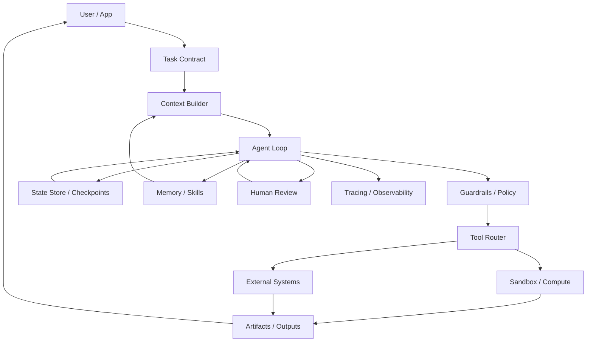

# Harness Engineering

Harness Engineering 是 Agent 产品化过程中最容易被低估的一层。

在早期 demo 中，团队往往把重点放在模型、prompt 和工具列表上。但一旦 Agent 需要处理文件、调用外部系统、执行代码、跨多步任务恢复、接受人工审批、留下可审计轨迹，真正决定产品能否稳定运行的就不只是模型，而是模型外面的 harness。

OpenAI 在 Agents SDK 更新中明确把 harness 描述为面向 Agent loop 的基础设施：让 Agent 能在受控工作区中检查文件、运行命令、编辑代码，并通过 sandbox 安全执行长任务。LangGraph 的 durable execution、Claude Code 的 subagents / hooks、CrewAI 的 flows 也都在解决同一类问题：如何把模型决策组织成可恢复、可观测、可治理的工程系统。

[citation:OpenAI - The next evolution of the Agents SDK](https://openai.com/index/the-next-evolution-of-the-agents-sdk/)  
[citation:LangGraph - Durable execution](https://docs.langchain.com/oss/javascript/langgraph/durable-execution)  
[citation:Claude Code - Subagents](https://docs.anthropic.com/en/docs/claude-code/sub-agents)  
[citation:CrewAI Documentation](https://docs.crewai.com/)

---

## 一、什么是 Harness

可以把 Agent 系统拆成三层：

| 层级 | 核心职责 | 典型产物 |
| --- | --- | --- |
| Model | 理解、推理、生成、决策 | 文本、工具调用、计划 |
| Harness | 组织上下文、工具、状态、权限、执行、观测 | 状态机、沙箱、guardrails、trace、checkpoint |
| Product | 用户体验、业务流程、协作和交付 | 页面、消息、任务、工单、报告、文件 |

Harness 不是单个 SDK，也不是一个 prompt 模板。它是连接模型能力和真实业务系统的执行层。

一个合格的 harness 至少要回答这些问题：

- Agent 当前任务是什么，完成标准是什么？
- 哪些上下文应该进入模型窗口，哪些应该保存在外部状态？
- Agent 能调用哪些工具，每个工具的权限和副作用是什么？
- 工具失败、模型跑偏、用户中断后如何恢复？
- 高风险动作如何审批、预览、回滚和审计？
- 长任务如何保存进度，如何跨容器、跨会话继续？
- 生产环境如何观察每一步模型调用、工具调用和 handoff？

换句话说，Harness Engineering 的目标不是让模型“更自由”，而是让模型在可控边界内更可靠地完成任务。

---

## 二、为什么 Agent 需要 Harness

OpenAI 在 Agents SDK 更新中指出，开发者需要的不只是强模型，还需要支持 Agent 检查文件、运行命令、写代码并跨多步持续工作的系统。它还提到，现有方案常见问题是：模型无关框架灵活但未必充分利用前沿模型能力，托管 Agent API 易部署但限制运行位置和敏感数据访问，而 provider SDK 又可能缺少足够的 harness 可见性。

这解释了 Agent 工程的核心矛盾：

- 模型越强，能做的动作越多。
- 动作越多，副作用和风险越大。
- 任务越长，状态、恢复和观测越重要。
- 业务越真实，权限、审计和人工介入越不能省。

所以 Agent 产品不能只堆模型能力，而要设计可执行系统。

### 从 Chatbot 到 Agent 的变化

| 维度 | Chatbot | Agent |
| --- | --- | --- |
| 目标 | 回答问题 | 完成任务 |
| 输出 | 文本为主 | 文件、代码、表格、工单、消息、系统变更 |
| 上下文 | 对话历史 | 对话、任务状态、文件、工具结果、外部数据 |
| 风险 | 幻觉、误导 | 幻觉、误操作、越权、数据泄露、不可回滚 |
| 工程重点 | Prompt、RAG、回答质量 | Harness、状态、权限、工具、观测、评估 |

当产品目标从“回答”变成“交付”，Harness 就成为必需品。

---

## 三、Harness 的七个核心模块

### 1. 任务合约

任务合约把用户的自然语言请求转成可执行任务。

它通常包括：

- 用户目标：用户真正想完成什么。
- 交付物：最终输出是什么，例如报告、代码 patch、Excel、日程、工单。
- 约束条件：时间、成本、数据来源、禁止动作、格式要求。
- 完成标准：什么算完成，什么情况需要继续验证。
- 风险等级：是否会写文件、发消息、花钱、访问敏感数据或修改生产系统。

没有任务合约，Agent 很容易做成“看起来很忙，但不可验收”的状态。任务合约的作用是让模型的行动围绕可检查的目标展开。

### 2. 上下文装配

上下文不是越多越好，而是要按当前决策动态装配。

OpenAI Agents SDK 的新 harness 提到 configurable memory、custom instructions、skills、AGENTS.md、MCP 等 primitives；Claude Code 的 subagents 使用独立上下文窗口来避免污染主会话；LangGraph 的 persistence 则把线程、checkpoint、state history 和 memory store 放到图执行体系中。

这些设计共同说明：上下文管理应该从“把材料塞进 prompt”升级为“按任务状态检索、摘要、隔离和注入”。

实用原则：

- 当前决策必须知道的信息放进模型窗口。
- 长期偏好、项目规范、历史轨迹保存在外部记忆或状态库。
- 子任务使用独立上下文，避免主任务被细节污染。
- 关键状态用结构化字段保存，不只靠对话历史。

[citation:OpenAI Agents SDK - Tracing](https://openai.github.io/openai-agents-python/tracing/)  
[citation:LangGraph - Persistence](https://docs.langchain.com/oss/javascript/langgraph/persistence)

### 3. 工具与动作层

工具不是 API 列表，而是 Agent 的动作边界。

工具设计要明确：

- 输入 schema：参数是否可校验。
- 输出结构：是否便于模型继续使用。
- 权限边界：能读什么、写什么、访问什么账号。
- 副作用：是否会修改文件、发消息、触发财务或生产动作。
- 错误格式：失败后模型能否知道如何修复。
- 审批策略：哪些动作必须 preview 或 confirm。

OpenAI Agents SDK 把 shell、apply patch、filesystem、MCP、skills 等放进 harness primitives；Claude Code subagents 支持为不同 agent 限制工具访问；hooks 则允许在工具调用前后插入检查、阻断或反馈。这些都说明工具层应该是可治理的，不应该只是把所有 API 暴露给模型。

[citation:Claude Code - Hooks reference](https://docs.anthropic.com/en/docs/claude-code/hooks)

### 4. 沙箱与计算隔离

Agent 一旦能运行命令、安装依赖、编辑文件，就需要沙箱。

OpenAI 的 Agents SDK 更新把 native sandbox execution 作为核心能力：开发者可以提供受控 workspace，让 Agent 在其中读写文件、运行代码、使用工具，并通过 Manifest 描述输入目录、输出目录和外部存储挂载。它还强调 harness 与 compute 分离：凭证不要暴露给模型生成代码所在的执行环境；如果 sandbox 失效，也应能通过外部化状态恢复。

这给 Agent 产品设计提供了一个重要原则：

> Harness 管控制权和状态，Sandbox 执行不可信动作。

常见实现：

| 需求 | 设计方式 |
| --- | --- |
| 文件编辑 | 在临时目录、分支或副本中执行 |
| 代码运行 | 使用容器、远程 sandbox 或受限 runtime |
| 数据分析 | 使用临时表、只读数据源、输出目录 |
| 办公自动化 | 先生成草稿，再由用户确认发送 |
| 生产操作 | 只允许生成变更计划，审批后由受控系统执行 |

### 5. 持久化与可恢复执行

长任务 Agent 必须能暂停、恢复和回放。

LangGraph 的 durable execution 把这个问题定义得很清楚：工作流在关键节点保存进度，遇到中断、人工介入、LLM 超时或长时间等待后，可以从上次记录状态继续，而不必重跑全部步骤。LangGraph persistence 通过 threads、checkpoints、state history 和 replay 支持 human-in-the-loop、time travel debugging 和 fault-tolerant execution。

OpenAI Agents SDK 也强调 snapshotting 和 rehydration：当容器失败或过期时，可以在新容器中恢复 Agent 状态并从 checkpoint 继续。

Agent 产品至少应保存：

- 任务合约。
- 当前状态。
- 已执行步骤。
- 工具输入输出。
- 用户审批记录。
- 中间产物位置。
- 最终交付物。

没有持久化，Agent 只能做短任务；有了持久化，Agent 才能做跨小时、跨天、跨人的工作流。

### 6. Guardrails 与人工介入

Guardrails 是 harness 里的防线，不是模型外的装饰。

OpenAI Agents SDK 将 guardrails 分为 input guardrails、output guardrails 和 tool guardrails。它们可以在用户输入、最终输出或工具调用前后做检查；触发 tripwire 时可以中止执行。Claude Code hooks 也提供了类似的工程插入点：`PreToolUse` 可在工具执行前拦截，`PostToolUse` 可在工具执行后反馈，`UserPromptSubmit` 可在模型处理前注入或阻断上下文。

常见 guardrails：

- 输入是否越权、恶意、缺少必要信息。
- 工具调用是否超出权限。
- 输出是否包含敏感信息。
- 生成内容是否满足格式和业务规则。
- 高风险动作是否已有用户确认。
- 模型是否试图绕过系统约束。

人工介入不应该只在失败后出现。更合理的设计是把 human-in-the-loop 当成状态机的一部分：低风险动作自动执行，高风险动作进入审批，信息不足进入澄清，不确定结果进入复核。

[citation:OpenAI Agents SDK - Guardrails](https://openai.github.io/openai-agents-python/guardrails/)

### 7. Tracing、观测与评估

没有 trace，就没有可调试的 Agent。

OpenAI Agents SDK 的 tracing 会记录一次 agent run 中的 LLM generations、tool calls、handoffs、guardrails 和自定义事件，并用于开发和生产中的调试、可视化和监控。它还提供敏感数据控制，允许只记录 span 而不包含具体输入输出。

生产级 Agent 至少要记录：

| 轨迹 | 作用 |
| --- | --- |
| 模型输入输出 | 判断模型是否理解任务 |
| 工具调用 | 判断动作是否正确 |
| 状态转移 | 判断流程是否卡住 |
| guardrail 触发 | 判断风险控制是否有效 |
| 人工审批 | 判断责任边界 |
| 成本和耗时 | 判断产品经济性 |
| 失败原因 | 形成回归测试集 |

评估指标也不能只看最终答案正确率。Agent 应该看任务完成率、一次通过率、人工接管率、工具失败率、重试次数、越权拦截率、平均成本、平均耗时和用户采纳率。

---

## 四、一个通用 Harness 参考架构

这个架构的核心是分离：

- 任务合约和用户界面分离。
- 模型推理和工具执行分离。
- harness 状态和 sandbox compute 分离。
- 长期记忆和当前上下文分离。
- 自动执行和人工审批分离。
- 生产动作和草稿/预览分离。

分离不是为了复杂化，而是为了让每一层可替换、可观测、可恢复。

---

## 五、产品设计清单

设计一个 Agent 功能前，先完成这张表。

| 问题 | 设计产物 |
| --- | --- |
| 用户最终要交付什么？ | 任务合约、验收标准 |
| Agent 可以做哪些动作？ | 工具清单、权限矩阵 |
| 哪些动作有副作用？ | 风险分级、审批策略 |
| 任务是否会跨多轮或跨天？ | 状态机、checkpoint、resume |
| 上下文从哪里来？ | context builder、memory、retrieval |
| 失败后如何恢复？ | retry、rollback、handoff |
| 如何知道 Agent 做错了？ | trace、回放、评估集 |
| 如何防 prompt injection？ | 输入过滤、工具隔离、凭证隔离 |
| 用户何时接管？ | human-in-the-loop 状态 |

如果这些问题没有答案，不要先写 prompt。先设计 harness。

---

## 六、常见反模式

### 1. 用大 prompt 代替 harness

把工具规则、业务流程、权限边界、错误处理全部写进系统提示词，短期能跑，长期难维护。稳定规则应该进入代码、状态机、guardrails 和工具 schema。

### 2. 工具权限过宽

Agent 可以调用的工具越多，越需要权限控制。Claude Code subagents 的做法值得借鉴：不同 subagent 可以有不同工具权限，而不是默认继承全部能力。

### 3. 没有执行状态

只保存对话历史，不保存任务状态，会导致 Agent 无法可靠恢复。长任务至少需要 checkpoint、当前步骤、已完成动作和待确认事项。

### 4. 让 sandbox 持有全部凭证

OpenAI 特别提醒 Agent 系统应假设存在 prompt injection 和 exfiltration attempts。凭证、权限和业务控制应留在 harness 或受控服务中，不应直接暴露给模型生成代码所在环境。

### 5. 没有 trace 和回放

Agent 失败如果不能回放，就不能系统改进。没有 trace，团队只能猜模型为什么错、工具为什么失败、用户为什么不信任。

---

## 七、落地路线

### 阶段 1：单任务闭环

选一个高频、低风险、边界清楚的任务。先定义任务合约、交付物和工具清单，不追求万能。

### 阶段 2：状态与观测

加入状态机、trace、工具日志和失败原因分类。目标是每次失败都能定位到“理解错、上下文错、工具错、权限错、输出错”中的哪一类。

### 阶段 3：沙箱与审批

把文件写入、命令执行、外部系统操作放进 sandbox 或草稿区。高风险动作必须 preview 和 confirm。

### 阶段 4：持久化与恢复

加入 checkpoint、resume、任务历史和人工接管。让 Agent 能处理中断、等待审批和跨天任务。

### 阶段 5：技能化与多 Agent

把稳定流程沉淀为 skills，把独立子任务交给 subagents。多 Agent 的前提是任务边界清楚、写入范围清楚、合并标准清楚。

---

## 八、结论

Harness Engineering 的本质，是把 Agent 从“会调用工具的模型”变成“可运行的产品系统”。

OpenAI Agents SDK 的 model-native harness、native sandbox execution、Manifest、snapshotting 和 rehydration，LangGraph 的 durable execution 和 persistence，Claude Code 的 subagents 与 hooks，CrewAI 的 flows、guardrails、memory 和 observability，都指向同一个结论：Agent 产品化的关键工程对象不是 prompt，而是 harness。

模型能力决定 Agent 的上限；Harness 决定它能不能安全、稳定、可解释地进入真实工作流。

---

## Sources

- [OpenAI - The next evolution of the Agents SDK](https://openai.com/index/the-next-evolution-of-the-agents-sdk/) - Agents SDK 中 model-native harness、native sandbox execution、Manifest、harness/compute 分离、snapshotting 与 rehydration 的一手说明。
- [OpenAI Agents SDK - Guardrails](https://openai.github.io/openai-agents-python/guardrails/) - input/output/tool guardrails、tripwire 和工作流边界。
- [OpenAI Agents SDK - Tracing](https://openai.github.io/openai-agents-python/tracing/) - agent run 中 LLM generation、tool call、handoff、guardrail 等 trace 记录。
- [LangGraph - Durable execution](https://docs.langchain.com/oss/javascript/langgraph/durable-execution) - 长任务中保存进度、暂停恢复和 fault-tolerant execution。
- [LangGraph - Persistence](https://docs.langchain.com/oss/javascript/langgraph/persistence) - threads、checkpoints、state history、replay、memory store 等持久化机制。
- [Claude Code - Subagents](https://docs.anthropic.com/en/docs/claude-code/sub-agents) - 子 Agent 独立上下文、专用 prompt、工具权限和复用方式。
- [Claude Code - Hooks reference](https://docs.anthropic.com/en/docs/claude-code/hooks) - `PreToolUse`、`PostToolUse`、`UserPromptSubmit` 等 hook 事件和阻断机制。
- [CrewAI Documentation](https://docs.crewai.com/) - agents、flows、tasks、guardrails、memory、observability 等多 Agent 工程概念。
