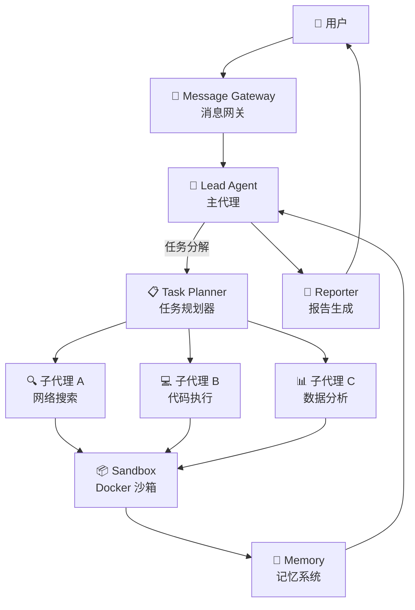
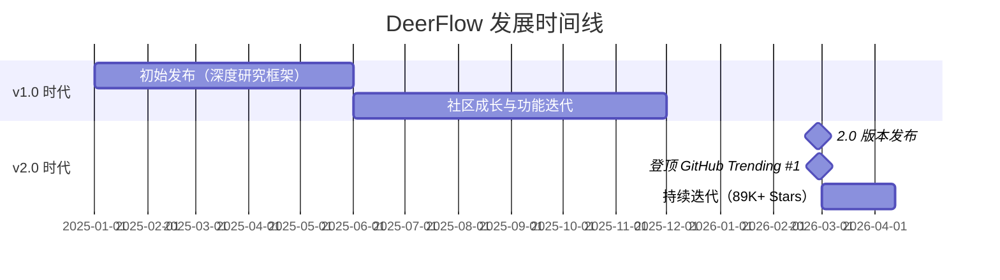

# DeerFlow 2.0


## 一、项目概览

**DeerFlow**（**D**eep **E**xploration and **E**fficient **R**esearch **Flow**）是字节跳动（ByteDance）开源的一个 **SuperAgent 编排框架**。它能够协调子代理（Sub-agents）、沙箱（Sandboxes）、记忆系统（Memory）、工具（Tools）和可扩展技能（Skills），处理从几分钟到数小时不等的复杂任务——涵盖研究、编程和创作领域 [citation:GitHub - bytedance/deer-flow](https://github.com/bytedance/deer-flow)。

### 关键指标

| 指标 | 数据 |
|------|------|
| ⭐ GitHub Stars | 89,000+ |
| 🍴 Forks | 7,500+ |
| 📜 开源协议 | MIT |
| 🏷️ 最新版本 | DeerFlow 2.0 |
| 📅 2.0 发布日期 | 2026 年 2 月 27 日 |
| 🏆 里程碑 | 2026 年 2 月 28 日登顶 GitHub Trending #1 |

[citation:One Open Source Project a Day - DeerFlow](https://dev.to/wonderlab/one-open-source-project-a-day-no33-deerflow-bytedances-superagent-execution-engine-83o)
[citation:ByteDance DeerFlow 2.0 Review](https://aihola.com/article/bytedance-deerflow-2-agent-runtime)

---

## 二、核心架构

DeerFlow 2.0 采用**多层服务架构**，基于 [LangGraph](https://github.com/langchain-ai/langgraph) 作为 Agent 编排层，使用有向无环图（DAG）管理复杂的工作流依赖关系 [citation:DeerFlow Architecture - DEV Community](https://dev.to/wonderlab/one-open-source-project-a-day-no33-deerflow-bytedances-superagent-execution-engine-83o)。



### 核心组件

| 组件 | 功能描述 |
|------|---------|
| **Lead Agent（主代理）** | 负责理解用户意图、分解任务、协调子代理 |
| **Sub-agents（子代理）** | 并行处理子任务，如搜索、编码、分析等 |
| **Sandbox（沙箱）** | 基于 Docker 的安全执行环境，支持 Shell、文件管理、浏览器、MCP 和 VSCode Server |
| **Memory（记忆系统）** | 跨对话持久化存储，支持上下文记忆 |
| **Tools（工具）** | 内置网络搜索、网页抓取、Python 执行等工具 |
| **Skills（技能）** | 渐进式加载的可扩展技能库，支持自定义 |
| **Message Gateway（消息网关）** | 统一的消息入口，支持多种渠道（Web UI、飞书等） |

[citation:DeerFlow - deerflow.tech](https://deerflow.tech/)
[citation:MarkTechPost - DeerFlow 2.0](https://www.marktechpost.com/2026/03/09/bytedance-releases-deerflow-2-0-an-open-source-superagent-harness-that-orchestrates-sub-agents-memory-and-sandboxes-to-do-complex-tasks/)

---

## 三、技术栈

| 层级 | 技术选型 |
|------|---------|
| **Agent 编排** | LangGraph（图状态机） |
| **后端** | Python + FastAPI |
| **前端** | Node.js + Next.js + React |
| **沙箱** | Docker 容器 |
| **流式传输** | Redis Streams |
| **LLM 支持** | 兼容 OpenAI、Qwen 等多种模型 |
| **部署** | Docker Compose 一键部署 |

[citation:DeerFlow Technical Stack - PyShine](https://pyshine.com/DeerFlow-SuperAgent-Harness/)
[citation:DeerFlow 2.0 Guide - Apidog](https://apidog.com/blog/deer-flow-guide-2026/)

---

## 四、核心特性

### 1. 任务分解与并行执行
DeerFlow 不采用单一模型处理所有任务的方式，而是将复杂任务分解为多个子任务，由不同的子代理并行处理 [citation:MarkTechPost - DeerFlow 2.0](https://www.marktechpost.com/2026/03/09/bytedance-releases-deerflow-2-0-an-open-source-superagent-harness-that-orchestrates-sub-agents-memory-and-sandboxes-to-do-complex-tasks/)。例如一个市场调研任务可以同时拆分为：
- 子代理 A：网络搜索融资数据
- 子代理 B：竞品分析
- 子代理 C：生成相关图表

### 2. "开箱即用"设计理念
DeerFlow 提供的是一个**已经能运行的完整系统**——内置默认执行模型、Skills、Sandbox 和 Memory 层。开发者可以在此基础上扩展，而非从零开始组装 [citation:DeerFlow 2.0 - dev.to](https://dev.to/arshtechpro/deerflow-20-what-it-is-how-it-works-and-why-developers-should-pay-attention-3ip3)。

### 3. All-in-One Sandbox
推荐的沙箱方案整合了浏览器、Shell、文件系统、MCP 和 VSCode Server 于一个 Docker 容器中，提供安全的隔离执行环境 [citation:DeerFlow - deerflow.tech](https://deerflow.tech/)。

### 4. 渐进式技能加载
技能按需加载，只有需要时才加载对应的技能文件，既节省资源又保持系统的灵活性 [citation:DeerFlow - deerflow.tech](https://deerflow.tech/)。

### 5. 多模型支持
支持 OpenAI 风格、Qwen 风格等多种推理模型。对于 Qwen 类模型，DeerFlow 通过 `extra_body.chat_template_kwargs.enable_thinking` 切换推理模式，并保留 vLLM 的非标准 reasoning 字段 [citation:DeerFlow README](https://github.com/bytedance/deer-flow/blob/main/README.md)。

### 6. 多渠道消息集成
支持 Web UI 和飞书（Feishu）等消息平台。对于飞书卡片更新，DeerFlow 会存储每条入站消息对应的卡片 message_id，并在运行完成前持续更新同一张卡片 [citation:DeerFlow backend README](https://github.com/bytedance/deer-flow/blob/main/backend/README.md)。

---

## 五、版本演进



- **v1.0（2025 年初）**：最初定位为"社区驱动的深度研究框架"，结合语言模型与网络搜索、爬虫、Python 执行等工具 [citation:fancyboi999 - GitHub](https://github.com/fancyboi999)。
- **v2.0（2026 年 2 月 27 日）**：从"深度研究 Agent"升级为**全栈 SuperAgent**，引入子代理系统、沙箱、记忆系统、可扩展技能等核心能力，发布当日即登顶 GitHub Trending [citation:ByteDance DeerFlow 2.0 Review](https://aihola.com/article/bytedance-deerflow-2-agent-runtime)。

---

## 六、与同类项目对比

| 项目 | Stars | 特点 |
|------|-------|------|
| **DeerFlow 2.0** | 89,000+ | 完整 SuperAgent 编排，沙箱+记忆+技能 |
| **Microsoft AutoGen** | 25,000+ | 多 Agent 对话框架 |
| **CrewAI** | 15,000+ | 角色扮演式多 Agent 框架 |

DeerFlow 的差异化在于其**开箱即用的完整系统**——不需要开发者从零组装，而是提供一个已能运行的 Agent 基础设施，开发者在此基础上按需扩展 [citation:ByteDance DeerFlow 2.0 Review](https://aihola.com/article/bytedance-deerflow-2-agent-runtime)。

---

## 七、快速上手

DeerFlow 使用 Python 开发后端，前端基于 Node.js。

```bash
# 1. repo clone
git clone https://github.com/bytedance/deer-flow.git

# 2. workspace
cd deer-flow

# 3. 生成配置文件
make config
# 编辑 `config.yaml`  和 `.env`

# 4. check, install
make check  # 校验 Node.js 22+、pnpm、uv、nginx
make install  # 安装 backend + frontend 依赖

# 5. start
make dev
```

启动后访问 `http://localhost:2026` 即可进行使用

[citation:DeerFlow - Gitee](https://gitee.com/ByteDance/deer-flow)

---

## 八、总结

DeerFlow 是目前 GitHub 上最热门的 AI Agent 框架之一，核心亮点包括：

1. **从"深度研究"进化为"全能 SuperAgent"**——不再局限于搜索调研，而是覆盖研究、编码、创作全场景
2. **LangGraph 编排 + 子代理并行**——通过图状态机管理复杂工作流，子代理可并行执行子任务
3. **沙箱隔离执行**——Docker 容器提供安全的代码执行和文件操作环境
4. **记忆 + 技能的可扩展架构**——跨会话持久化记忆，渐进式技能加载
5. **开源社区驱动**——MIT 协议，89K+ Stars，活跃的社区贡献

---

## Sources

- [GitHub - bytedance/deer-flow](https://github.com/bytedance/deer-flow) - 官方源码仓库
- [DeerFlow Official Site](https://deerflow.tech/) - 官方网站
- [bytedance/deer-flow | DeepWiki](https://deepwiki.com/bytedance/deer-flow) - 架构文档
- [One Open Source Project a Day (No.33): DeerFlow - DEV Community](https://dev.to/wonderlab/one-open-source-project-a-day-no33-deerflow-bytedances-superagent-execution-engine-83o) - 技术分析
- [ByteDance DeerFlow 2.0: Open-Source Agent Runtime Review](https://aihola.com/article/bytedance-deerflow-2-agent-runtime) - 版本对比
- [MarkTechPost - DeerFlow 2.0](https://www.marktechpost.com/2026/03/09/bytedance-releases-deerflow-2-0-an-open-source-superagent-harness-that-orchestrates-sub-agents-memory-and-sandboxes-to-do-complex-tasks/) - 发布报道
- [DeerFlow 2.0: What It Is - dev.to](https://dev.to/arshtechpro/deerflow-20-what-it-is-how-it-works-and-why-developers-should-pay-attention-3ip3) - 开发者指南
- [DeerFlow Architecture - PyShine](https://pyshine.com/DeerFlow-SuperAgent-Harness/) - 架构分析
