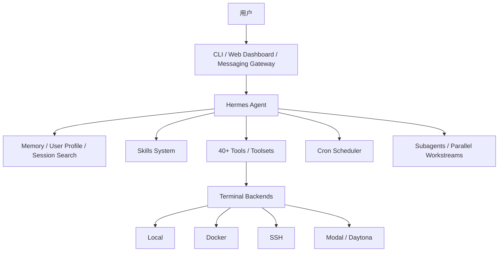

# Hermes Agent

Hermes Agent 是 Nous Research 开源的个人 Agent 系统，定位不是 IDE 内的代码补全工具，也不是单一聊天机器人，而是一个可以常驻在服务器、云环境或本地终端中的持久化 Agent。它的核心卖点是“会随使用而成长”：持续积累记忆、从复杂任务中生成技能、在多平台消息入口中保持连续对话，并通过工具、沙箱和定时任务完成真实工作。

[citation:Hermes Agent Documentation](https://hermes-agent.nousresearch.com/docs/)  
[citation:NousResearch/hermes-agent](https://github.com/NousResearch/hermes-agent)

---

## 一、项目定位

Hermes Agent 更接近“个人 Agent Runtime + 工具执行环境 + 消息网关”的组合。

它解决的问题不是“让模型回答得更好”，而是让模型可以长期运行在一个可交互、可记忆、可扩展、可调度的执行环境里。用户可以从 CLI、Telegram、Discord、Slack、WhatsApp、Signal 等入口和它对话；Agent 可以调用终端、文件系统、浏览器、搜索、视觉、图像生成、TTS、子 Agent、定时任务等工具；执行环境可以是本机、Docker、SSH、Daytona、Singularity、Modal 等后端。

| 维度 | Hermes Agent 的特点 |
| --- | --- |
| 项目性质 | 开源个人 Agent / Agent Runtime |
| 开发方 | Nous Research |
| 开源协议 | MIT |
| 主要入口 | CLI、Web Dashboard、消息网关 |
| 核心能力 | 记忆、技能、自我改进、工具调用、沙箱、定时任务、子 Agent、GEPA 式提示词优化 |
| 模型支持 | Nous Portal、OpenRouter、OpenAI-compatible endpoint 等 |
| 运行环境 | Linux、macOS、WSL2、Termux，以及多种远程/容器后端 |

---

## 二、核心架构

可以把 Hermes Agent 拆成四层理解。



### 入口层

Hermes 提供 CLI、Web Dashboard 和 Messaging Gateway。CLI 适合开发者直接操作；Web Dashboard 适合配置、查看会话、管理技能和网关；Messaging Gateway 则让 Agent 通过 Telegram、Discord、Slack、WhatsApp、Signal 等渠道持续响应。

### Agent 层

Agent 层负责理解任务、调用工具、写入记忆、创建或使用技能，并在多轮会话中维持上下文。它不是只做单轮回答，而是围绕长期任务、个人偏好和项目背景持续工作。

### 工具与执行层

Hermes 内置 40+ 工具，覆盖搜索、终端、文件系统、浏览器自动化、视觉、图像生成、TTS、代码执行、子 Agent、记忆、任务规划、定时任务、多模型推理等能力。工具执行可以落在本地、容器、SSH 或 serverless 后端中。

### 记忆与技能层

Hermes 的关键差异化在于学习闭环：它会沉淀记忆，搜索过去会话，并把复杂任务中的经验整理成可复用技能。技能采用 `SKILL.md` 这类可迁移格式，适合把过程性知识变成 Agent 可加载的操作手册。

[citation:Hermes Agent Website](https://nousresearch.com/hermes-agent/)

---

## 三、关键能力

### 1. 持久化记忆

Hermes 支持跨会话记忆和用户画像。它会把长期偏好、项目背景、已解决问题和常用流程沉淀下来，避免每次对话都从零开始。

这类能力适合个人工作流，但也要注意边界：记忆越强，越需要定期审计、删除错误记忆，并区分“事实”“偏好”“临时任务状态”。

### 2. 技能系统

Hermes 的技能类似 Agent 的过程性记忆：当它反复处理某类任务时，可以把步骤、约束、工具调用方式和经验整理成技能。之后遇到相似任务，Agent 可以按需加载技能，而不是把所有说明都塞进上下文。

适合沉淀为技能的内容包括：

- 项目构建、测试、发布流程。
- 常用数据分析步骤。
- GitHub issue / PR 处理规范。
- 研究报告模板。
- 特定平台的 API 操作流程。
- 团队内部约定和检查清单。

### 3. GEPA：反思式提示词与技能优化

GEPA（Genetic-Pareto）是一个用来优化文本组件的框架，优化对象可以是提示词、代码片段、Agent 架构说明、配置或策略。它的核心思路不是只看一个分数，而是把执行轨迹、错误信息、工具调用结果、推理日志和评测反馈交给反思模型分析，让模型诊断失败原因，再生成新的候选版本，并通过 Pareto-aware selection 保留在不同样本上表现互补的候选。

[citation:GEPA GitHub](https://github.com/gepa-ai/gepa)  
[citation:GEPA Paper](https://arxiv.org/abs/2507.19457)

这和 Hermes 的关系可以这样理解：Hermes 负责长期运行、使用工具、沉淀记忆和技能；GEPA 更像一个离线或半自动的“技能/提示词进化器”。当 Hermes 的某个技能已经有稳定任务、评测集和失败样例时，可以用 GEPA 优化 `SKILL.md`、系统提示词、工具描述、任务分解模板或多 Agent 协作规则，再把效果更好的版本回写到 Hermes 技能库中。

典型流程：

- 选定要优化的文本组件，例如某个 Hermes 技能、任务提示词或工具使用规范。
- 准备一组代表性任务样本和评测指标，例如正确率、格式合规率、人工评分或自动单测通过率。
- 记录 Hermes 执行时的轨迹，包括输入、输出、工具调用、失败原因和人工反馈。
- 用 GEPA 基于这些轨迹反思失败模式，生成多个候选改写版本。
- 在验证集上比较候选版本，只把稳定提升、没有破坏安全边界的版本沉淀为新技能。

GEPA 适合用于“已经能评测的重复任务”，例如代码修复流程、RAG 检索提示词、数据抽取规范、客服回复策略、工具调用说明和多 Agent 分工模板。它不适合没有评测标准、样本太少、风险过高或反馈只能靠主观即时判断的任务；这类任务仍然需要人工先定义成功标准和安全边界。

### 4. 多平台消息网关

Hermes 可以通过一个 gateway 连接多个聊天平台。这让 Agent 不再绑定在本机终端里，而是成为一个常驻服务：用户可以在手机上发消息，让 Agent 在云主机里继续执行任务。

这类设计适合日报、巡检、提醒、研究、文件处理等异步任务；但如果涉及敏感系统，应当限制允许的用户、群聊、工作目录和工具权限。

### 5. 定时任务

Hermes 内置 cron scheduler，可以用自然语言配置日报、备份、审计、检查等定时任务，并把结果投递到指定平台。

典型用法：

- 每天早上生成项目状态摘要。
- 每晚检查仓库未处理 issue。
- 每周整理知识库更新。
- 定期抓取公开数据并生成报告。

### 6. 子 Agent 与并行工作流

Hermes 支持创建隔离的 subagents 来处理并行任务。对复杂任务来说，这可以减少主对话的上下文压力：主 Agent 负责分解和整合，子 Agent 分别完成搜索、编码、验证或分析。

但并行 Agent 不等于自动可靠。实际使用时需要明确每个子任务的输入、输出、完成标准和写入范围，避免多个 Agent 修改同一文件或重复执行高成本工具。

### 7. 多后端执行环境

Hermes 支持 local、Docker、SSH、Daytona、Singularity、Modal 等终端后端。这个设计让它可以在不同成本和隔离需求之间切换：

| 后端 | 适合场景 |
| --- | --- |
| Local | 个人本机、低风险任务 |
| Docker | 需要隔离依赖和文件系统的任务 |
| SSH | 远程服务器维护、云主机任务 |
| Modal / Daytona | 按需唤醒、闲置低成本的云端执行 |
| Singularity | HPC / 受限集群环境 |

---

## 四、安装、配置与启动

Hermes 官方推荐在 Linux、macOS、WSL2 或 Termux 中安装。原生 Windows 支持不稳定，建议使用 WSL2。

### 安装

```bash
curl -fsSL https://raw.githubusercontent.com/NousResearch/hermes-agent/main/scripts/install.sh | bash
source ~/.bashrc
```

如果使用 `zsh`：

```bash
source ~/.zshrc
```

### 初始配置

```bash
# 交互式完整配置
hermes setup

# 单独配置模型
hermes model

# 单独配置工具
hermes tools
```

### 启动 CLI

```bash
hermes
```

常用命令：

| 命令 | 用途 |
| --- | --- |
| `/new` 或 `/reset` | 开启新会话 |
| `/model` | 切换模型 |
| `/skills` | 查看或调用技能 |
| `/compress` | 压缩上下文 |
| `/usage` | 查看用量 |
| `/retry` | 重试上一轮 |
| `/undo` | 撤销上一轮 |
| `Ctrl+C` | 中断当前任务 |

### 启动 Web Dashboard

```bash
hermes dashboard --host 0.0.0.0 --port 8080
```

Web Dashboard 适合做配置管理、会话查看、技能浏览和 gateway 管理。

### 配置消息网关

```bash
# 配置 gateway
hermes gateway setup

# 启动 gateway
hermes gateway

# 安装为系统服务
hermes gateway install
```

[citation:Hermes Agent GitHub README](https://github.com/NousResearch/hermes-agent)

---

## 五、适合什么场景

### 个人常驻 Agent

如果你希望有一个长期在线、记得项目背景、能从手机触发任务的个人 Agent，Hermes 很适合。它不是一次性聊天窗口，而是可以运行在 VPS 或云环境里的长期服务。

### 研究与信息整理

Hermes 有搜索、浏览器、文件、记忆和定时任务能力，适合做长期主题跟踪、资料整理、日报生成、论文线索收集等任务。

### DevOps 与轻量自动化

Hermes 可以跑 shell、读写文件、调用远程环境，也支持 cron。对于个人服务器、实验环境、非生产仓库，它可以承担一部分巡检和维护工作。

### Agent 技能实验

如果重点是研究“技能如何沉淀”“Agent 如何复用过程经验”，Hermes 是一个值得观察的项目。它把技能系统、记忆系统、消息入口和工具执行放在了同一个产品里。再结合 GEPA 这类反思式优化方法，可以进一步研究技能如何从“人工总结”走向“基于评测轨迹自动迭代”。

---

## 六、不适合什么场景

Hermes 不适合直接接入高风险生产系统后放任自动执行。

尤其是以下场景，需要额外设计审批和隔离：

- 生产数据库写入。
- 自动发邮件、发群消息或对外发布内容。
- 云资源创建、删除或扩容。
- 涉及客户隐私、账号凭证或财务数据的任务。
- 多人共用同一个 Agent 但没有权限隔离的场景。

Hermes 的能力边界很宽，但越宽越需要治理。把它当成“个人自动化工作台”比当成“无人监管生产运维系统”更合适。

---

## 七、工程注意事项

### 1. 先限制工作目录

让 Agent 在明确的 workspace 中工作，不要默认暴露整个 home 目录。对文件写入、命令执行和网络访问设置清晰边界。

### 2. 高风险工具使用确认机制

对删除文件、发送消息、安装依赖、修改远程服务、写入数据库等动作，应要求用户确认。能 dry run 的动作优先 dry run。

### 3. 定期清理和审计记忆

长期记忆可能保存过期事实、错误偏好或临时任务信息。个人 Agent 也需要记忆治理：查看、修改、删除和隔离。

### 4. 把重复流程沉淀成技能

不要让 Agent 每次从头摸索同一套流程。稳定流程应该写成技能，并明确输入、输出、检查步骤和失败处理方式。

### 5. 用评测闭环优化技能

如果要引入 GEPA 或类似优化器，不要直接让它改写线上技能。更稳妥的做法是先建立离线评测集，保存失败轨迹和人工反馈，用候选技能在验证集上对比，再由人工审阅后合并。优化目标也不能只看任务分数，还要检查权限边界、输出格式、成本、延迟和失败时的可恢复性。

### 6. 给定时任务设置可观测输出

Cron 任务不要只“默默运行”。建议每次输出执行摘要：触发时间、做了什么、成功/失败、下一步建议、需要人工处理的事项。

---

## 八、版本信号

Hermes Agent v0.9.0 于 2026 年 4 月 13 日发布。官方 release 将其称为 “everywhere release”，重点包括本地 Web Dashboard、移动与消息平台增强、Fast Mode、后台进程监控，以及更深入的安全加固。

这说明 Hermes 正在从 CLI 工具向长期运行的个人 Agent 平台演进。后续值得重点关注：

- Web Dashboard 是否成为主要管理入口。
- Gateway 是否能稳定覆盖更多消息平台。
- 技能系统是否形成可复用社区生态，并与 GEPA 这类反思式优化器结合。
- 沙箱和权限模型是否能支撑更严肃的生产场景。
- 记忆系统是否提供更强的审计和治理能力。

[citation:Hermes Agent Releases](https://github.com/NousResearch/hermes-agent/releases)

---

## 九、总结

Hermes Agent 的价值不在于某个单点模型能力，而在于把个人 Agent 需要的基础设施放在一起：多入口、长期记忆、技能系统、工具执行、沙箱后端、定时任务和子 Agent。GEPA 补上的则是另一块拼图：当 Agent 的技能、提示词和工具说明可以被评测时，可以用执行轨迹和自然语言反馈持续优化这些文本组件。

如果你想研究 Agent 如何从聊天窗口变成长期工作系统，Hermes 是一个很好的样本。它展示了 Agent 产品化的一条路线：模型只是能力核心，真正决定可用性的，是运行时、工具、记忆、权限、调度和用户接入方式。

---

## Sources

- [Hermes Agent Documentation](https://hermes-agent.nousresearch.com/docs/) - 官方文档入口，介绍项目定位、安装、配置、工具、记忆、技能和消息网关。
- [NousResearch/hermes-agent](https://github.com/NousResearch/hermes-agent) - 官方 GitHub 仓库，包含 README、安装命令、功能概览和迁移说明。
- [Hermes Agent Website](https://nousresearch.com/hermes-agent/) - 官方产品页，介绍多平台入口、工具、技能、执行环境和应用场景。
- [Hermes Agent Releases](https://github.com/NousResearch/hermes-agent/releases) - 版本发布记录，包含 v0.9.0 更新信息。
- [GEPA GitHub](https://github.com/gepa-ai/gepa) - 官方实现，介绍 Genetic-Pareto、反思式文本进化、DSPy 集成和 `optimize_anything` API。
- [GEPA Paper](https://arxiv.org/abs/2507.19457) - 论文《GEPA: Reflective Prompt Evolution Can Outperform Reinforcement Learning》，解释用轨迹反思和 Pareto 前沿优化提示词的方法。
